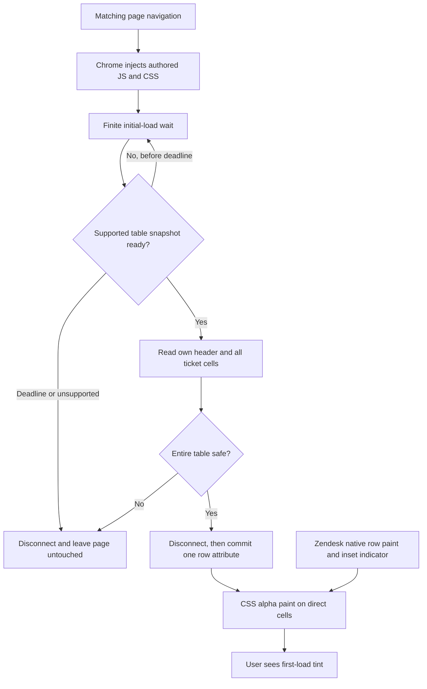

# Phase 02: First Tint on a Real View - Research

**Researched:** 2026-09-08
**Domain:** Chrome MV3 content scripts, evidence-bounded DOM parsing, translucent CSS table paint
**Confidence:** MEDIUM — official platform guidance and current repository evidence support the design; startup timing and final live appearance require validation.

<user_constraints>
## User Constraints (from CONTEXT.md)

Source: [VERIFIED: .planning/phases/02-first-tint-on-a-real-view/02-CONTEXT.md:17-43,102-104]. The following decisions, discretion and deferred scope are copied verbatim.

<!-- DATA_b4e7c390_START -->
### Locked Decisions

### Palette and Emphasis — Delegated Defaults
- **D-01:** Use conventional warm-to-cool priority colours: Urgent soft red, High soft orange, Normal soft yellow, and Low soft green. All four receive a distinct tint; do not introduce a fifth colour for missing or unknown priority. These are product defaults, not a claim about Zendesk's own palette.
- **D-02:** Keep the treatment pale and translucent so a dense list remains comfortable to read. Urgent has the strongest visual emphasis, High next, with Normal and Low quieter but still distinguishable. Do not add flashing, animation, badges, stripes, or text recolouring. Exact colour values and opacity are implementation discretion, constrained by the glance test, text legibility, and live-state validation.

### Hover, Selection, and Unread Rows — Delegated Defaults
- **D-03:** Retain priority tint during hover and selection, composited with Zendesk's existing paint. Native hover/selection must remain clearly distinguishable, including the first-cell selection indicator. Preserve unread/bold text and normal focus/click behavior. If the tint obscures those states, reduce its opacity during those states through CSS; do not replace native highlight colours or interaction handlers.
- **D-04:** Follow the observed paint boundary: tint only direct cells of positively identified ticket rows, leaving Zendesk's row paint and first-cell inset indicator intact. Do not apply colour to sticky headers, group headers, wrappers, or unrelated page elements. The visual full-row effect must not depend on overwriting the native row background.

### Blank and Unreadable Priorities — Delegated Defaults
- **D-05:** In a positively identified, supported English table with an unambiguous Priority column, whitespace-only or empty Priority cells remain untinted. Other rows with exact recognised labels are tinted normally. Never infer Normal or Low from an empty cell, and never present an all-blank column as a missing column. This explicitly distinguishes a deliberately uncoloured blank row from a failed partial application.
- **D-06:** A non-empty unrecognised priority value, an ambiguous header, missing expected cells, or an unsupported language makes the table unsafe to colour. Leave that table untinted, including otherwise recognised rows; do not guess from substrings, nearby text, icons, or position. Validate the candidate table before applying markers so a late unreadable row does not leave earlier rows coloured. No Priority column also means no tint. Phase 2 adds no popup, hint, or locale diagnosis; Phase 4 retains ownership of the three-state user-facing failure behavior. Phase 3 retains ongoing cleanup/reapplication responsibility.
- **D-07:** Use the Phase 1 evidence-supported English boundary and exact trimmed labels: `Priority`, `Urgent`, `High`, `Normal`, and `Low`, in the supported `html[lang="en"]` shell. Blank versus unknown is a conservative rendering policy, not a new claim about the meaning of empty live cells. The observed corpus does not establish broader locale or shell compatibility.

### Carried-Forward Product and Evidence Constraints
- **D-08:** Zero setup, default enabled, full-row tint only, with all palette values in a stylesheet driven by one namespaced row data attribute. JavaScript identifies priority and sets the attribute; it does not contain the product palette. No bundler, minification, remote code, telemetry, or network calls. The loaded extension assets must be byte-identical to their repository source.
- **D-09:** Preserve the settled manifest contract: Manifest V3, `storage` as the only permission, no `host_permissions` block, and content scripts matching only `https://*.zendesk.com/agent/*`. Storage is reserved for the later default-on boolean; no ticket content is persisted. Do not reopen the permission decision or add permissions for test convenience.
- **D-10:** Reuse the admitted Garden/test-id selector strategy and resolve header ownership in the same table as the candidate rows. Preserve the proven boundary even though Phase 3 owns expanded grouped/sticky-header coverage. Do not promote an unproven fallback to production merely because an older research sketch suggests it.
- **D-11:** Validate the final tint against actual native hover, selection, unread/bold states, and all four priority colours in the supported light interface. Offline fixtures establish parsing and marker behavior; they do not prove visual compositing. Preserve the existing authenticated workflow: the user controls login, MFA, sensitive navigation, account actions, and live interaction checkpoints. Operational tickets and saved views are not changed by the agent. Any retained live evidence must satisfy the existing sanitization/privacy boundary.
- **D-12:** Carry Phase 1's passed verification with its explicit AR-01-13 accepted exception. Historical package-approval independence remains not-attested. Existing fixture provenance is approved repository-byte re-admission, not a fresh capture. Do not convert either limitation into stronger evidence or install unapproved dependency versions.

### the agent's Discretion
- Choose and tune exact CSS colours, opacities, and state-specific reductions without asking for individual shade approvals. Keep the D-01 colour mapping and D-02/D-03 outcomes.
- Choose the namespaced attribute, extension source folder, file names, module/test organization, and initial-load readiness mechanism within the no-build/no-network constraints.
- Reuse the installed exact-version test tools. Identify any additional dependency need during research; user delegation of visual defaults does not approve new packages.
- Reconcile the roadmap's literal "no JavaScript file in the repo contains a colour value" wording with existing recon evidence parsers/tests, which already contain RGB strings. Product palette separation is mandatory; do not silently delete historical evidence or claim a literal repository-wide check passes when it does not.

### Deferred Ideas (OUT OF SCOPE)

None newly introduced. Preserve existing scope: continuous reapplication and broad fail-quiet cleanup in Phase 3; toolbar states, hints, and persistent toggle in Phase 4; public publishing in Phase 5; dark mode, colourblind-safe palette, custom colours, alternate treatments, and additional locales in v2.
<!-- DATA_b4e7c390_END -->
</user_constraints>

## Summary

Build one complete initial-load tracer: the manifest injects a classic JavaScript content script and one stylesheet; a finite startup controller finds the admitted table; a read-only whole-table preflight resolves the header and labels; one commit adds the row attribute; CSS paints direct cells. This is an implementation recommendation under D-08/D-10, using Chrome's static injection mechanism. [CITED: https://developer.chrome.com/docs/extensions/reference/manifest/content-scripts]

The important evidence correction is that the observed table owns its own header and native hover/selection paint belongs to the row. The final selector authorization is explicitly `garden-pair`; `test-id-pair | unproven | none` and `structural | unproven | none` cannot authorize fallbacks. [VERIFIED: SELECTORS.md:78-88,162-179,297-310] Blank rows are deliberately untinted under D-05; unknown non-empty values invalidate the entire candidate table under D-06, even if earlier rows were recognizable. This is a product policy, not an inference from the sanitized fixture labels. [VERIFIED: .planning/phases/02-first-tint-on-a-real-view/02-CONTEXT.md:28-30]

**Primary recommendation:** Use a three-file unpacked extension, one classic IIFE, a two-stage read/commit pass, alpha cell backgrounds, and the already installed test tools. Finish with a separate real-view visual checkpoint. Do not introduce packages or persistent observation for this phase. [VERIFIED: .planning/phases/02-first-tint-on-a-real-view/02-CONTEXT.md:33-42]

## Architectural Responsibility Map

These are recommended ownership assignments derived from D-03/D-04/D-08/D-09/D-11. [VERIFIED: .planning/phases/02-first-tint-on-a-real-view/02-CONTEXT.md:24-42]

| Capability | Primary Tier | Secondary Tier | Rationale |
|---|---|---|---|
| URL scope and asset injection | Chrome extension platform | Browser client | Declarative manifest controls loading. |
| Initial readiness, table/header/priority validation | Isolated content script | Shared DOM, read-only input | Read the current rendered table without API requests. |
| Row markers | Content script | Shared DOM, one owned attribute | Write only after complete preflight. |
| Palette and native-state composition | Browser CSS renderer | Existing Zendesk CSS | Paint cells while host rows retain their backgrounds. |
| Preferences | Chrome storage, deferred implementation | Phase 4 | Reserve permission; Phase 2 requires no storage read or write. |
| Final visual acceptance | User-controlled live Chrome session | Sanitized evidence artifact | Offline marker tests cannot satisfy the visual requirement. |
| Backend, SSR, CDN, remote database | None | None | No new service tier is needed. |

<phase_requirements>
## Phase Requirements

Descriptions below reproduce the requirement text; the support column is the recommended verification seam. [VERIFIED: .planning/REQUIREMENTS.md:20-31,51,59-62]

| ID | Description | Research Support |
|---|---|---|
| DETECT-01 | Extension locates the Priority column by its header rather than by column position, so it survives user-configured column order | Same-table header scan; move header and corresponding cells together in synthetic variants. |
| DETECT-02 | Extension reads each ticket row's priority and resolves it to one of Urgent, High, Normal or Low | Exact trimmed allowlist; blank/unknown distinction and atomic preflight. |
| TINT-01 | Each ticket row is tinted according to its priority, with a visually distinct tint for each of the four values | Four attribute rules plus live glance comparison. |
| TINT-02 | Row text remains legible over every tint | CSS changes only background paint; live light-interface legibility check. |
| TINT-03 | Zendesk's own row states — hover, selected, unread/bold — remain visible and are not suppressed by the tint | Preserve row background, first-cell inset, typography, focus and handlers; live interaction matrix. |
| TINT-04 | The tint is applied as a translucent layer that composites over whatever Zendesk paints, rather than replacing the row's background colour | Alpha backgrounds on direct cells, no row-background replacement. |
| TINT-05 | All colour is declared in a stylesheet driven by a single data attribute, so the visual treatment can be changed without touching detection logic | Runtime asset audit; stylesheet-only shade edit; retained recon evidence explicitly excluded from product palette. |
| CTRL-01 | Extension works immediately on install with nothing to configure | Default-on startup without a gesture or stored setting; first matching page load acceptance. |
| STORE-02 | Extension declares no `host_permissions` block and requests `storage` as its only permission | Parse manifest and assert exact permission surface. |
| STORE-03 | The content script matches only `https://*.zendesk.com/agent/*`, excluding the customer-facing Help Center on the same domain | Exact match-array assertion; no optional grants or fallback frame widening. |
| STORE-05 | Shipped code is unminified and byte-identical to repo source | Load the authored extension directory directly; inventory all declared runtime files. |
</phase_requirements>

## Project Constraints

No root AGENTS.md or project skill files were found by this session's filesystem discovery; the configured instruction document is `"./.claude/CLAUDE.md"`. [VERIFIED: .planning/config.json:63-64; session filesystem discovery] The actionable current instructions are: use GSD for changes; Chrome MV3, narrow permissions, zero configuration, no API tokens, no remote code/network/telemetry, and no tenant data off-device. The GSD rule reads: “Do not make direct repo edits outside a GSD workflow unless the user explicitly asks to bypass it.” [VERIFIED: .claude/CLAUDE.md:11-19,354-366]

The large generated stack section contains earlier research. Its no-storage recommendation, broader host variants, extra development dependencies and row-plus-cell targeting are superseded by D-04/D-08/D-09/D-12; do not copy them into plans. [VERIFIED: .claude/CLAUDE.md:260-294; .planning/phases/02-first-tint-on-a-real-view/02-CONTEXT.md:24-37]

Explicit current configuration is `"nyquist_validation": false`, `"security_enforcement": true`, `"security_asvs_level": 1`, and `"granularity": "coarse"`. Therefore this report omits the Nyquist Validation Architecture template, retains meaningful behavioral test guidance, and includes security research. [VERIFIED: .planning/config.json:20-24,47-49,77-78]

## Standard Stack

### Core

| Technology | Version / Contract | Purpose | Source |
|---|---|---|---|
| Chrome MV3 static content scripts | Manifest V3; existing approved permission contract | Inject local authored JS and CSS automatically | [CITED: https://developer.chrome.com/docs/extensions/reference/manifest/content-scripts] |
| Native JavaScript and DOM | Classic IIFE; no imports or emitted build | Detection, preflight, finite startup | Recommendation under D-08. [VERIFIED: .planning/phases/02-first-tint-on-a-real-view/02-CONTEXT.md:33,41] |
| Native CSS | Unlayered attribute selectors and alpha cell backgrounds | Four colors and state-specific opacity tuning | [CITED: https://www.w3.org/TR/CSS22/tables.html#table-layers] |
| MutationObserver and timers | Native browser APIs | Temporary startup readiness only | [CITED: https://developer.mozilla.org/en-US/docs/Web/API/MutationObserver/observe] |

### Supporting — existing tools only

Exact repository declarations are `"happy-dom": "20.13.1"` and `"vitest": "4.1.11"`; both installed package manifests report those same versions. [VERIFIED: package.json:13-15; node_modules/happy-dom/package.json:1-6; node_modules/vitest/package.json:1-12]

| Tool | Version | Role | Disposition |
|---|---|---|---|
| vitest | 4.1.11 | Product DOM integration and controlled startup timing | Reuse approved installed version. [VERIFIED: DEPENDENCY-APPROVALS.md:9-10] |
| happy-dom | 20.13.1 | Detached fixture DOM and attribute assertions | Reuse approved installed version. [VERIFIED: DEPENDENCY-APPROVALS.md:9-10] |
| Node built-ins | Local Node v26.8.1 | Existing smoke tests, file/manifest assertions, classic-script execution in a VM context | [VERIFIED: session node --version]; [CITED: https://nodejs.org/api/vm.html] |

**Installation:** none. Do not add a compiler, type package, CSS parser, bundler, automation driver or browser-testing dependency for this slice. Existing tests already import Vitest and happy-dom; Vitest documents this DOM environment. [VERIFIED: test/recon/fixture-contract.test.js:14-15]; [CITED: https://vitest.dev/guide/environment.html]

### Package verification limitation

A non-installing legitimacy recheck returned `SUS` for both existing tools with every registry observation null and reasons `unknown-age`, `unknown-downloads`, `no-repository`. Exact-version npm lookups failed with `getaddrinfo ENOTFOUND registry.npmjs.org`. These are failed observations, not findings that the packages lack repositories or are malicious. No fresh publish date, latest version, download count or registry postinstall observation was obtainable. [VERIFIED: session package-legitimacy and npm-view output]

| Package | Registry | Age / Downloads / Published date | Source repository | Gate verdict | Disposition |
|---|---|---|---|---|---|
| vitest | npm lookup failed | No observation | Installed metadata: `git+https://github.com/vitest-dev/vitest.git` | SUS — missing remote observations | Reuse installed exact approval only; no install authorization. [VERIFIED: node_modules/vitest/package.json:10-13] |
| happy-dom | npm lookup failed | No observation | Installed metadata: `https://github.com/capricorn86/happy-dom` | SUS — missing remote observations | Reuse installed exact approval only; no install authorization. [VERIFIED: node_modules/happy-dom/package.json:5-6] |

Neither package earns a fresh `[VERIFIED: npm registry]` tag. If a plan changes from reuse to installation, repeat the registry/postinstall checks and resolve the SUS checkpoint before installing; do not use the accepted historical exception as future approval. The existing independence record remains `not-attested`; the user decision is `risk accepted`, with no waiver for future dependency changes. [VERIFIED: DEPENDENCY-APPROVALS.md:28-42; .planning/phases/01-dom-recon-spike/01-RISK-ACCEPTANCE.md:11-15]

## Architecture Patterns

### System Architecture Diagram

Recommended flow under D-05/D-06/D-08; all terminal branches disconnect startup observation. [VERIFIED: .planning/phases/02-first-tint-on-a-real-view/02-CONTEXT.md:28-33,41]



### Recommended Project Structure

Proposed new paths, not existing source facts:

```text
extension/
  manifest.json
  content.js
  zhroma.css
test/
  extension/
    initial-tint.test.js
    runtime-contract.test.js
```

Use a single classic IIFE with small named helpers for locating, preflight, commit and startup. Test the exact manifest-declared script bytes in a fresh Node VM context supplied with the fixture document, observer and timers. Node provides `vm.runInNewContext(code, contextObject, options)`; this executes script source without requiring the product to export ESM or contain a test hook. VM use belongs exclusively to trusted repository test code; it is not a security sandbox. [CITED: https://nodejs.org/api/vm.html]

### Pattern 1: Conservative, same-table preflight

Verbatim selector vocabulary from the admitted ledger:

<!-- DATA_92d7f08a_START -->
- `table[data-garden-id="tables.table"][data-test-id="generic-table"]`
- `[data-garden-id="tables.head"][data-test-id="generic-table-head"]`
- `[data-garden-id="tables.body"][data-test-id="generic-table-body"]`
- `[data-garden-id="tables.row"][data-test-id="generic-table-row"]`
- `[data-garden-id="tables.group_row"][data-test-id="generic-table-rows-group-by"]`
- `data-garden-id="tables.cell"`
- `data-garden-id="tables.header_cell"`
<!-- DATA_92d7f08a_END -->

[VERIFIED: SELECTORS.md:73-75] The observed exact labels are `Priority`, `Urgent`, `High`, `Normal`, `Low`; the shell selector is `html[lang="en"]`. [VERIFIED: SELECTORS.md:199-202] Use these literals without casing normalization, substring matching or locale expansion. [VERIFIED: .planning/phases/02-first-tint-on-a-real-view/02-CONTEXT.md:29-30]

Recommended algorithm under D-05/D-06/D-10:

1. Check the supported document language. Discover tables with the admitted paired identifiers. Treat multiple competing body tables as ambiguous for this initial slice; do not choose the first match.
2. Bind the direct owned head/body, one owned header row, and direct header cells. Use all direct header positions when calculating the index, including the selection/action columns; never filter blank header cells out first.
3. Require exactly one exact trimmed Priority header for tinting. Zero matches is a supported no-tint result only after header topology succeeds. Duplicate matches are unsafe.
4. Enumerate body children. Positively identify ticket rows; permit known group rows without reading or tinting their content. An unexplained row type or malformed ticket-row shape makes the candidate unsafe.
5. Require each ticket row to have the expected direct-cell count and admitted cell identifiers. Reject unsupported spanning cells rather than inventing grid arithmetic. Read only its resolved Priority cell.
6. Whitespace-only text produces an uncolored blank entry. An exact recognized label produces a marker entry. Any other non-empty text rejects the whole table.
7. Build the entire proposed change list without mutations. Recheck table connectivity/ownership and run the final preflight synchronously immediately before committing. Do not `await` between final reads and writes.
8. Commit only the one owned attribute for recognized rows; blanks receive no marker. If a write unexpectedly throws, remove only markers written by this attempt and stop quietly.

These are implementation recommendations for the current evidence boundary, not claims that every future Zendesk layout satisfies these predicates. [VERIFIED: .planning/phases/02-first-tint-on-a-real-view/02-CONTEXT.md:28-35]

### Pattern 2: A finite startup controller, not continuous liveness

Chrome's `document_idle` guarantees that the DOM is complete at injection, not that application-specific asynchronous data has arrived. Static CSS can arrive before construction, but tint still requires the later row markers. Do not promise a flash-free first paint. [CITED: https://developer.chrome.com/docs/extensions/develop/concepts/content-scripts]; [CITED: https://developer.chrome.com/docs/extensions/reference/manifest/content-scripts]

Recommended discretionary starting policy: observe child-list and character-data changes during a **15-second maximum window**, with a **100-millisecond candidate-table quiet interval** before final validation. Start the hard deadline once; unrelated DOM churn must never extend it. These numbers are proposed tuning parameters, not measured Zendesk loading guarantees. [ASSUMED: A1]

Observe before the first discovery scan to avoid a scan/subscribe gap. Coalesce startup callbacks; do not rescan on every individual mutation record. Watch only changes that can affect discovery or the candidate table; do not observe the new marker attribute. If there is a complete safe snapshot with at least one recognized label after the quiet interval, disconnect, cancel timers, re-preflight and commit once. Keep no-table, incomplete, absent-header and all-blank candidates untinted while waiting; at deadline, stop cleanly. A complete all-blank table remains a supported blank result, never missing Priority. This deliberately allows asynchronously populated blank shells time to acquire labels. [CITED: https://developer.mozilla.org/en-US/docs/Web/API/MutationObserver/observe]; [VERIFIED: .planning/phases/02-first-tint-on-a-real-view/02-CONTEXT.md:28-29,41]

Disconnect before committing markers and clear all scheduled callbacks on success, expiry, error or page departure. After any terminal state, sorting, table replacement or another view must not restart this controller. The later persistent observer will reuse the detection/commit seams in Phase 3. `disconnect()` stops further notifications until observation resumes. [CITED: https://developer.mozilla.org/en-US/docs/Web/API/MutationObserver/disconnect]

**Honest boundary:** quiet DOM does not prove semantic completion. A row appearing after the successful initial snapshot is later liveness work; tests must cover late unknown rows *before* the initial commit, and the real first-load checkpoint must establish that the proposed startup policy handles the actual load. If it cannot, refine this bounded mechanism or collect a sanitized positive readiness signal; do not label an unverified timer as sufficient. [ASSUMED: A1]

### Pattern 3: Direct-cell alpha paint

The admitted normal state has transparent rows/cells, native hover and selection paint belongs to the row, and selection also uses the first cell's inset shadow. Verbatim native-state values include `aria-selected: true`, `aria-selected: false`, `rgba(31, 115, 183, 0.08)`, `rgba(31, 115, 183, 0.16)`, and `rgb(31, 115, 183) 3px 0px 0px 0px`. [VERIFIED: SELECTORS.md:169-176]

Use alpha `background-color` on the direct cells only. Cell backgrounds are above row backgrounds in table painting order; inset shadows are painted above the element background. Therefore this preserves the existing selection-indicator property and lets the row's native fill contribute beneath the tint. This is the mechanism, not proof of the final visual result. [CITED: https://www.w3.org/TR/CSS22/tables.html#table-layers]; [CITED: https://www.w3.org/TR/css-backgrounds-3/#shadow-layers]

Use unlayered narrowly scoped selectors; if required, confine `!important` to the cell background declaration. Do not write `background` shorthand, row background, `box-shadow`, element `opacity`, text color, font weight, positioning, z-index or pointer handlers. Palette custom properties may be set by attribute rules in CSS; JavaScript sets no CSS variables. Reduce alpha through CSS for native hover/selected states if the live comparison requires it. These recommendations implement D-02/D-03/D-04; `@layer` is explicitly out of scope. [VERIFIED: .planning/phases/02-first-tint-on-a-real-view/02-CONTEXT.md:21-24,33; .planning/REQUIREMENTS.md:95]

## Code Examples

These are proposed implementation sketches, not an assertion that runtime files already exist. New identifiers and paths below are discretionary choices. Existing DOM literals are quoted in Pattern 1; `data-zhroma-priority` is the proposed new attribute. Using the exact English labels as its values avoids an unnecessary second priority enum.

### Manifest skeleton

The fixed values `storage`, `https://*.zendesk.com/agent/*`, and Manifest V3 come from D-09. [VERIFIED: .planning/phases/02-first-tint-on-a-real-view/02-CONTEXT.md:34] `document_idle`, `ISOLATED` and top-frame behavior come from Chrome's manifest reference. [CITED: https://developer.chrome.com/docs/extensions/reference/manifest/content-scripts]

```json
{
  "manifest_version": 3,
  "name": "Zhroma",
  "version": "0.1.0",
  "permissions": ["storage"],
  "content_scripts": [{
    "matches": ["https://*.zendesk.com/agent/*"],
    "js": ["content.js"],
    "css": ["zhroma.css"],
    "run_at": "document_idle",
    "world": "ISOLATED",
    "all_frames": false
  }]
}
```

The name/version/file names are proposed. No service worker, popup, messaging, web-accessible resources or storage calls are necessary for the first-load tracer. Keep the frozen storage declaration even though Phase 2 does not use it. Match patterns themselves convey page access and can generate permission warnings; do not describe this as a zero-access extension. [VERIFIED: .planning/phases/02-first-tint-on-a-real-view/02-CONTEXT.md:33-34]; [CITED: https://developer.chrome.com/docs/extensions/develop/concepts/declare-permissions]

### Preflight before mutation

```javascript
// Proposed internal pattern; helpers implement Pattern 1 in the same classic IIFE.
const snapshot = inspectCandidateTable(document);
if (!snapshot.safe) return;

const changes = [];
for (const entry of snapshot.entries) {
  if (entry.priority !== null) changes.push(entry);
}
// No awaits, layout reads, HTML insertion, or CSS writes between these stages.
for (const { row, priority } of changes) {
  row.setAttribute('data-zhroma-priority', priority);
}
```

Here `safe`, `entries`, `priority` and the blank sentinel `null` are proposed internal API choices, not existing repository types. Include rollback/error containment and connectivity checks in the implementation. The essential requirement is whole-table validation before mutation. [VERIFIED: .planning/phases/02-first-tint-on-a-real-view/02-CONTEXT.md:28-29]

### CSS selector and palette seed

Proposed CSS; the sample shade is a starting value awaiting visual validation, not measured acceptable paint. Apply the same proven direct-cell selector shape to the other three priorities using the locked orange/yellow/green mapping. [ASSUMED: A2]

Keep the marker on the ticket row itself and paint only its direct cells:

```css
html[lang="en"]
table[data-garden-id="tables.table"][data-test-id="generic-table"]
> tbody[data-garden-id="tables.body"][data-test-id="generic-table-body"]
> tr[data-garden-id="tables.row"][data-test-id="generic-table-row"][data-zhroma-priority="Urgent"]
> td[data-garden-id="tables.cell"] {
  background-color: rgb(220 38 38 / 0.14);
}
```

Use four explicit rules or CSS-only custom properties; a normal/hover/selected palette matrix must retain recognizable hue without suppressing native states. No shade or alpha is approved by this snippet. D-01/D-02 delegate tuning; A2 records the unverified visual outcome. [VERIFIED: .planning/phases/02-first-tint-on-a-real-view/02-CONTEXT.md:20-24,40]

## Don't Hand-Roll

| Problem | Don't Build | Use Instead | Basis |
|---|---|---|---|
| Script injection | Background worker plus programmatic injection | Static manifest entry | [CITED: https://developer.chrome.com/docs/extensions/develop/concepts/content-scripts] |
| Styling | JS color map, injected style text, fake selection highlights | Declarative direct-cell stylesheet | [VERIFIED: .planning/phases/02-first-tint-on-a-real-view/02-CONTEXT.md:24-33] |
| Locale support | Regexes, case folding, icon/ARIA guessing or translated dictionaries | Exact supported labels and conservative no-tint | [VERIFIED: .planning/phases/02-first-tint-on-a-real-view/02-CONTEXT.md:29-30] |
| Test isolation | Product-only test exports or transformed duplicate parser | Execute manifest-declared bytes with existing DOM environment | [CITED: https://nodejs.org/api/vm.html] |
| Readiness | Route patching, endless polling or persistent global observer | Native bounded startup observer | [VERIFIED: .planning/REQUIREMENTS.md:91]; [CITED: https://developer.mozilla.org/en-US/docs/Web/API/MutationObserver/disconnect] |
| Supply chain | Extra runner, CSS framework or bundler | Existing installed tools and browser APIs | [VERIFIED: .planning/phases/02-first-tint-on-a-real-view/02-CONTEXT.md:33,42] |

## Common Pitfalls

- **Tinting before the last row is validated.** A recognized first row followed by an unknown last row must leave every row untinted. Include this exact adverse ordering in a test. [VERIFIED: .planning/phases/02-first-tint-on-a-real-view/02-CONTEXT.md:29]
- **Treating blank text as a failure or default priority.** Preserve the distinction between blank entries and unknown non-empty labels; an all-blank column still exists. [VERIFIED: .planning/phases/02-first-tint-on-a-real-view/02-CONTEXT.md:28-30]
- **Using the fixture's recorded column index in production.** The manifest records `"priorityHeaderIndex": 6`; that describes those bytes only. The product must calculate the index after reordering. [VERIFIED: test/fixtures/manifest.json:34-50]; [VERIFIED: .planning/REQUIREMENTS.md:20]
- **Borrowing a sibling header or styling group rows.** The current winning boundary owns its header; the fallback verdict is explicitly `selector-authorization: garden-pair`. Preserve this even though expanded topology coverage belongs to Phase 3. [VERIFIED: SELECTORS.md:85-88,301-304]
- **Replacing the native selection inset with a large tint shadow.** Use cell backgrounds and leave the original shadow property intact. [VERIFIED: SELECTORS.md:169-170]; [CITED: https://www.w3.org/TR/css-backgrounds-3/#shadow-layers]
- **A passing parser suite mistaken for a passing extension.** Execute the shipped classic script and audit manifest/CSS boundaries, then retain the live visual gate. [VERIFIED: .planning/phases/02-first-tint-on-a-real-view/02-CONTEXT.md:36,82]
- **A startup observer that never stops.** Test expiry, success and subsequent DOM changes explicitly; do not include thirty view switches or continuous cleanup tasks in this phase. [VERIFIED: .planning/ROADMAP.md:109-123]
- **Promoting historical evidence into new facts.** The Phase 1 report says `status: passed`, `score: 23/24 must-haves verified; 1 explicit acceptance exception`, and `historical_attestation: not-attested`. Fixture provenance says “not a fresh live capture.” Preserve all of those limits. [VERIFIED: .planning/phases/01-dom-recon-spike/01-VERIFICATION.md:7-14,31-39; test/fixtures/manifest.json:13]

## Meaningful Automated Tests and Human Proof

Current scripts are `"test": "npm run test:recon"` and `"test:recon": "node --test test/recon/*.smoke.js && node node_modules/vitest/vitest.mjs run --config vitest.config.js"`; the Vitest include list is only `['test/recon/*.test.js']`. [VERIFIED: package.json:9-11; vitest.config.js:3-6] Extend discovery deliberately to the proposed product test directory, preserve the recon suite, and make the default test command run both. Merely supplying a new CLI file filter does not replace Vitest's configured inclusion rules. [CITED: https://vitest.dev/config/include.html]

Recommended tests derive directly from the Phase Requirements and D-05/D-06/D-10; names and new paths below are proposals.

| Test group | Meaningful assertions | Requirement / boundary |
|---|---|---|
| Real admitted fixture | Execute actual script; expected row labels yield four exact attributes, headers/group rows/wrappers stay unchanged | DETECT-02, TINT-01, D-10 |
| Header movement | Move Priority and corresponding row cells together to first/middle/last positions; correct row mapping remains | DETECT-01 |
| Blank semantics | Empty, spaces, whitespace around recognized labels; mixed blank/known and all-blank columns; no fifth marker | D-05, DETECT-02 |
| Entire-table refusal | Unknown last row, duplicate Priority header, missing cells, unsupported spans, wrong language, ambiguous tables; assert zero markers anywhere in that table | D-06 |
| Context isolation | Decoy labels in subject/ARIA, nested unrelated table, foreign header and group rows; no fallback matches | D-07/D-10 |
| Initial startup | Table already present, delayed table, delayed headers/cells/text, unknown row added during settle period, all-blank timeout, absent table timeout | CTRL-01, A1 |
| Controller disposal | Zero pending controller timers/observers after success/expiry; later replacement receives no tint | Phase 2/3 boundary |
| DOM preservation | Existing text, ARIA selection, classes, inline styles, focusability and handlers remain; only owned marker changes | TINT-03 |
| Runtime contract | Exact manifest grants/matches; actual JS parses as classic script; references stay within unpacked source; no remote resource or ticket-storage path | STORE-02/03/05 |
| CSS contract | Exactly four recognized priority mappings; alpha paint on direct cells only; no JS palette or row/box-shadow/typography overwrite | TINT-04/05 |

Use explicit expected labels, not an expected list imported from the product parser. Derive edge variants in test memory and label them synthetic; do not rewrite the admitted corpus or hashes. The admission record binds `"zendesk-view-priority-present.html"`, `"zendesk-view-priority-absent.html"`, and `"zendesk-view-grouped-long.html"` to re-admitted bytes. [VERIFIED: test/fixtures/manifest.json:13-15,62-64,105-107]

Use Vitest fake timers for the startup clock and a controllable observer test seam, plus at least one real happy-dom MutationObserver integration. Timer advancement alone must not be mistaken for draining every DOM mutation callback. Vitest documents `vi.useFakeTimers()`, `vi.advanceTimersByTime()` and `vi.useRealTimers()`; restore timers and dispose the test window between cases. [CITED: https://vitest.dev/guide/mocking/timers]

Suggested quick command after discovery is updated: `node node_modules/vitest/vitest.mjs run --config vitest.config.js test/extension`. Suggested full command: `npm test` after it includes both suites. These are planned commands, not checks already run by this research.

**Human proof boundary:** with the authored extension directory loaded and no setting configured, the user opens the approved English light-interface view and controls hover, selection, unread-row inspection and column-order comparison. Refresh after a user-owned column reorder to test detection without requiring Phase 3 live reapplication. Compare all four tints, native highlights, first-cell inset and legibility; do not trigger bulk ticket actions. Do not mutate operational tickets to manufacture priorities or unread status. Missing authentic state coverage stays pending; sanitized synthetic examples may supplement it but cannot close D-11. Retain only sanitized non-identifying results. [VERIFIED: .planning/phases/02-first-tint-on-a-real-view/02-CONTEXT.md:36; .planning/phases/01-dom-recon-spike/01-CONTEXT.md:17-25]

## Roadmap Wording Reconciliation

The literal criterion says “no JavaScript file in the repo contains a colour value.” [VERIFIED: .planning/ROADMAP.md:104] Existing recon JavaScript contains `'rgba(0,0,0,0)'`, and existing test evidence contains `rgb(255,255,255)`; those are evidence-processing values, not a product palette. [VERIFIED: scripts/interaction-evidence.js:44-47; test/recon/interaction-evidence.smoke.js:21-23]

Recommended planning clarification, authorized as discretion in D-08: **“Changing a product tint requires a stylesheet edit only. No shipped extension JavaScript contains product palette values or writes CSS. Recon evidence parsers/tests retain observed color strings outside the runtime asset boundary.”** Preserve the requirement ID and historical evidence. Put this explicit clarification in the plan and update current roadmap acceptance wording during authorized planning; do not silently claim the old repository-wide assertion passes. [VERIFIED: .planning/phases/02-first-tint-on-a-real-view/02-CONTEXT.md:33,43]

Audit every manifest-declared script and transitive/local runtime reference. Use the dedicated unpacked folder as the runtime boundary; do not load the entire repository as the extension root or copy recon helpers into it. Static checks support review but do not prove all security or visual properties by string matching alone. This is the recommended implementation of D-08/STORE-05. [VERIFIED: .planning/phases/02-first-tint-on-a-real-view/02-CONTEXT.md:33,81-86]

## State of the Art

| Earlier assumption | Current phase contract | Evidence |
|---|---|---|
| Duplicate sibling header needs resolution | Own-table header; no unproven sibling fallback | [VERIFIED: SELECTORS.md:85-88] |
| Zero API permissions, broad wildcard hosts | Only `storage`; only `https://*.zendesk.com/agent/*`; no host_permissions | [VERIFIED: .planning/phases/02-first-tint-on-a-real-view/02-CONTEXT.md:34] |
| Tint rows and cells, or replace inset shadow | Tint direct cells and preserve native row/background/inset | [VERIFIED: .planning/phases/02-first-tint-on-a-real-view/02-CONTEXT.md:24-25] |
| Blank and unknown both stop all rendering | Blank is untinted; non-empty unknown invalidates table | [VERIFIED: .planning/phases/02-first-tint-on-a-real-view/02-CONTEXT.md:28-30] |
| Permanent observer in first product slice | Finite first-load controller now; continuous observation in Phase 3 | [VERIFIED: .planning/phases/02-first-tint-on-a-real-view/02-CONTEXT.md:12,41] |

These are project evidence/decision corrections, not ecosystem deprecation claims.

## Security Domain

Use **ASVS 5.0.0** chapter names, not the obsolete numbering in the generic research template. The official ASVS project names 5.0.0 as stable and recommends version-qualified control references. [CITED: https://owasp.org/www-project-application-security-verification-standard/]

The following is a recommended scope mapping for this browser-only phase, not an ASVS certification. Category names follow OWASP's published taxonomy. [CITED: https://cornucopia.owasp.org/taxonomy/asvs-5.0]

| ASVS 5 category | Applies | Standard control / phase action |
|---|---|---|
| V1 Encoding and Sanitization | Yes | Treat DOM text as untrusted; no HTML interpretation or dynamic code. |
| V2 Validation and Business Logic | Yes | Exact allowlist and whole-table preflight. |
| V3 Web Frontend Security | Yes | Isolated content script; no page-world bridge; preserve host behavior. |
| V6 Authentication / V7 Session Management | No new subsystem | Do not read credentials, cookies or tokens; Zendesk/user retain account ownership. |
| V8 Authorization | Scope boundary | Exact static URL match and supported DOM boundary; no additional privileges. |
| V11 Cryptography | No runtime requirement | No new secrets, encryption scheme or credential store. |
| V12 Secure Communication | Constrained | HTTPS match only; extension initiates no network requests. |
| V13 Configuration / V14 Data Protection | Yes | Frozen manifest; no ticket persistence/logging; local authored assets. |
| V15 Secure Coding and Architecture / V16 Security Logging and Error Handling | Yes | Finite controller, fail quietly, no raw DOM/error-value dumps. |

| Threat | STRIDE | Recommended mitigation |
|---|---|---|
| Malicious/unexpected priority cell text causes wrong styling or code execution | Tampering | Exact label allowlist; never insert HTML, evaluate cell strings or build dynamic selectors from them. |
| Tenant data enters logs/storage/network | Information disclosure | Read only header/priority for processing; no logging text, network APIs or storage calls. |
| Selector drift paints unrelated UI | Tampering | Paired identifiers, owned topology, no fallback promotion, all-or-nothing preflight. |
| Broad observer causes needless ongoing work | Denial of service | Hard deadline, coalesced startup checks, disconnect on every terminal path. |
| Manifest/API growth expands privilege | Elevation of privilege | Exact manifest equality tests and source review of runtime APIs. |

These mitigations implement D-06/D-08/D-09/D-10; preserve AR-01-13 as a separate accepted historical risk, not a fresh package security attestation. [VERIFIED: .planning/phases/02-first-tint-on-a-real-view/02-CONTEXT.md:29-37; .planning/phases/01-dom-recon-spike/01-RISK-ACCEPTANCE.md:13-15]

## Environment Availability

| Dependency | Available | Version / observation | Fallback |
|---|---|---|---|
| Node | Yes | `v26.8.1` from `node --version` | Existing project engine range is `^20.19.0 || ^22.12.0 || >=24.0.0`. [VERIFIED: package.json:6-7; session probe] |
| npm | Yes | `11.19.0` from `npm --version` | No install needed. [VERIFIED: session probe] |
| Existing test dependencies | Yes | Installed `"version": "4.1.11"` / `"version": "20.13.1"` | Reuse exact versions. [VERIFIED: node_modules/vitest/package.json:4; node_modules/happy-dom/package.json:3] |
| Google Chrome | Yes | Installed application version `152.0.7977.77` from application metadata | User-owned unpacked-extension test later. No browser session opened. [VERIFIED: session PlistBuddy probe] |
| npm registry from shell | Unavailable in this session | `ENOTFOUND registry.npmjs.org` | Existing installed tooling; no fresh registry claims. [VERIFIED: session npm-view output] |
| Authenticated real-view acceptance | Not exercised during research | User-controlled future checkpoint | Offline tests cannot replace final native-state proof. [VERIFIED: .planning/phases/02-first-tint-on-a-real-view/02-CONTEXT.md:36] |

No external service is needed for implementation. Registry availability becomes a planning dependency only if installation is proposed; current recommendation requires none. Live visual evidence remains necessary for phase acceptance under D-11.

## Assumptions Log

| # | Claim needing validation | Section | Risk if wrong / disposition |
|---|---|---|---|
| A1 | A 15-second startup cap with a 100-millisecond candidate quiet interval catches the real initial table in the tested shell | Initial readiness | Late initial rows can be missed; validate during the real first-load checkpoint and tune within delegated discretion. This is not an app-complete signal or performance promise. |
| A2 | Proposed pale CSS seeds can satisfy distinctness, legibility and native-state preservation | CSS example | Tints could obscure selection or be indistinguishable; user-controlled visual checkpoint must pass after tuning. |

Both are unproven outcome claims, not locked decisions. The user already delegated the implementation parameters and shades; no separate approval of individual numbers/colors is required. Product acceptance is still required. [VERIFIED: .planning/phases/02-first-tint-on-a-real-view/02-CONTEXT.md:36,40-41]

## Open Questions and Planning Shape

1. **Initial-load semantic completion — RESOLVED (planning disposition):** 02-01 Tasks 1–2 specify the bounded startup implementation and delayed-arrival/disposal regressions; 02-02 Task 2 specifies authentic cold-load validation and a test-backed tuning loop under delegated discretion if initial rows arrive late or in delayed batches. No observed semantic readiness signal is supplied by the admitted evidence, and the timer policy remains heuristic. A1's actual runtime outcome remains unverified until authentic live evidence exists; missing evidence stays `human_needed` and unresolved observed defects stay `gaps_found`.
2. **All four authentic priorities and unread/native states — RESOLVED (planning disposition):** 02-02 Task 1 prepares the source-bound acceptance record and tests that reject unsupported pass claims; Task 2 gates acceptance on authentic observations of all four priority colours, legibility, hover, selection/inset, unread/bold and focus/click against the final loaded assets, with delegated CSS tuning and repeat checks as needed. A2's actual visual outcome remains unverified until authentic live evidence exists. Unavailable priorities/states stay pending with `human_needed`; unresolved observed defects stay `gaps_found`. User-owned interactions and the prohibition on manufacturing operational data remain intact; no new shade or timing approval is required.
3. **Literal palette criterion — RESOLVED (planning disposition):** current ROADMAP Phase 2 success criterion 4 already clarifies the boundary: product tints change through the stylesheet only, shipped extension JavaScript contains no product palette values or CSS writes, and recon evidence parsers/tests retain observed colour strings outside runtime assets. 02-01 Tasks 1–2 implement and check that runtime contract; 02-02 Task 2 preserves historical RGB evidence during tuning. This records the existing wording reconciliation and requirement traceability, not implementation or live acceptance completion.

Recommend **two coarse plans**: first deliver the full fixture-to-marker-to-CSS unpacked tracer with manifest/source and failure regressions; second validate the same authored assets on the real view and tune CSS/startup as needed. The first plan must produce a loadable vertical slice, not just framework scaffolding. The second may end with human-needed evidence if actual visual conditions are unavailable. These are recommendations under the current phase's `Mode: mvp` and `"granularity": "coarse"`. [VERIFIED: .planning/ROADMAP.md:92-97; .planning/config.json:78]

## Sources

**Current repository authority:** Phase 2 CONTEXT, REQUIREMENTS, ROADMAP, PROJECT and STATE; SELECTORS and fixture manifest; package manifests, installed manifests and dependency approval/risk records; Phase 1 VERIFICATION; existing fixture and interaction tests. Each substantive repository fact is cited inline. Earlier architecture/stack/pitfall research was consulted as hypothesis and superseded where current evidence conflicts.

**Official documentation / MEDIUM:** Chrome content scripts, manifest content-scripts and permission declaration pages; W3C table layers and CSS backgrounds/shadows; MDN MutationObserver; Vitest environment, include and timer guidance; Node VM; OWASP ASVS and its current chapter taxonomy. Direct links appear alongside claims.

**Research seam:** Five research-plan questions routed four platform/library questions to Context7 and ASVS to websearch. Context7 libraries used: `/websites/developer_chrome_extensions`, `/mdn/content`, `/vitest-dev/vitest`; results were cross-checked against primary pages. The installed confidence seam returned MEDIUM for Context7, MEDIUM for officially cross-checked websearch, and LOW for standalone webfetch even with its verified flag. Overall confidence remains MEDIUM rather than overriding those tiers. Repository source reads establish exact local contracts; they do not confer fresh live-DOM or registry confidence. Research-store persistence was omitted to honor this task's single repository-output scope.

## Metadata

- **Stack confidence:** MEDIUM for official API guidance; installed versions verified locally; registry freshness unobserved.
- **Architecture confidence:** MEDIUM; supported by current evidence and platform semantics, with explicit startup/visual assumptions.
- **Pitfalls confidence:** MEDIUM; source-backed failure boundaries with proposed negative tests.
- **Runtime State Inventory:** Not applicable — this creates the first product assets; it does not rename or migrate deployed runtime state.
- **Research date:** 2026-09-08.
- **Recheck:** Re-read platform guidance and fresh DOM evidence after a material Zendesk/Chrome change; validate A1/A2 during implementation.
- **Changes made by this research:** This report only in the repository. No product edits, package installs, authenticated interaction, commits or acceptance-status changes.
