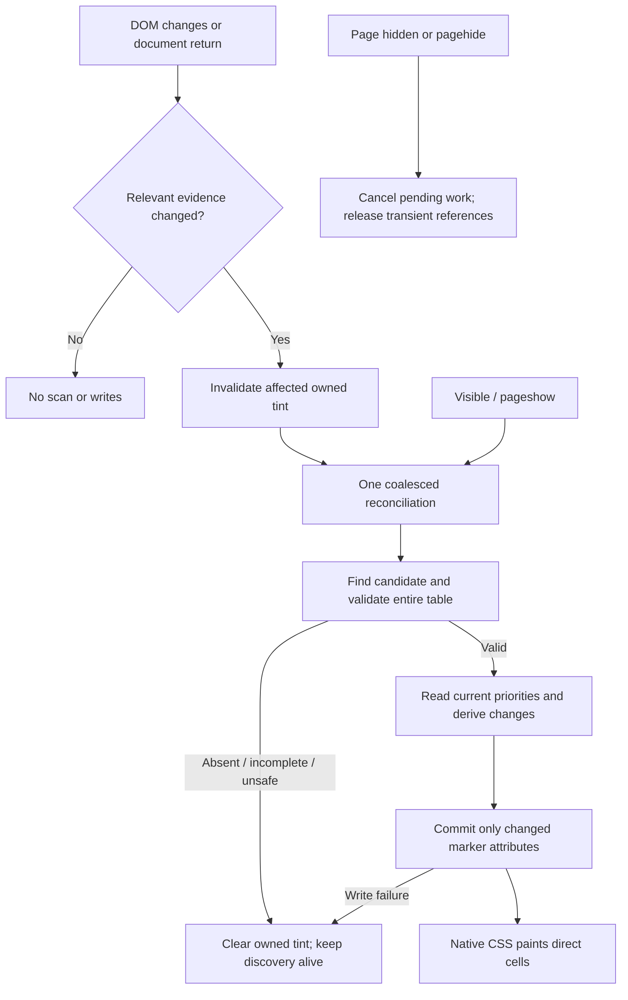

# Phase 03: The Tint Survives Everything - Research

**Researched:** 2026-09-09
**Domain:** Persistent DOM reconciliation in a source-equals-shipped Chrome content script
**Confidence:** MEDIUM — platform guidance is cited; runtime findings are source-grounded; performance is unmeasured.

<user_constraints>
## User Constraints (from CONTEXT.md)

Verbatim locked decisions and delegated discretion, copied from the Phase 03 context. [CITED: .planning/phases/03-the-tint-survives-everything/03-CONTEXT.md]

<!-- DATA_a89f37c2_START -->
## Implementation Decisions

### Transition Appearance — Delegated Defaults
- **D-01:** Prefer a brief native, untinted view over a stale or incorrect priority colour. When a DOM change invalidates the current interpretation, clear affected extension tint markers promptly; reapply only after the current table validates. Do not blank unchanged, still-valid tints for unrelated page mutations.
- **D-02:** Validate the table before applying its tint set. Preserve Phase 2's distinction: blank Priority cells stay untinted while recognised rows may tint; a non-empty unknown value, ambiguous ownership/header, or malformed table invalidates the table as a whole. Existing markers must also be cleared when a recognised priority becomes blank or unsafe.
- **D-03:** Restore colour without fades, flashing, overlays, spinners, or changes to native hover, selection, focus, and unread styling. Retain the settled stylesheet palette and direct-cell paint boundary.

### Automatic Recovery — Delegated Defaults
- **D-04:** A temporarily absent, incomplete, Priority-less, or unsupported table is a quiet no-op, not a permanent end to tinting for the document. Automatically retry when relevant DOM changes produce a supported, fully valid English view. No reload or user intervention should be needed.
- **D-05:** Recovery must include opening Zendesk and then clicking a view, even after spending longer than the existing 15-second startup window on the landing page. It must also include Next/Previous pagination, sorting, refresh, switching between views with and without Priority, and priority text changes on retained row nodes.
- **D-06:** On failure, remove only Zhroma-owned styling and leave native page content, attributes, and interaction behavior intact. Do not expose errors or diagnostic UI in the page. Do not retain a partly applied table after a failed write. Keep the future Phase 4 diagnosis seam possible without adding toolbar behavior now.

### Long-Session Behavior — Delegated Defaults
- **D-07:** Returning from a ticket, dashboard, or other non-view surface to a supported view restores tint automatically. Those non-view surfaces remain visually untouched. Use the DOM evidence boundary; do not introduce history patching, route detection, webNavigation, or new permissions.
- **D-08:** Returning to the browser tab after inactivity must show current priorities without a manual refresh. Revalidate on return as needed, including supported document restoration. Background work should remain bounded and event-driven; exact lifecycle events and scheduling are planner discretion.
- **D-09:** Repeated navigation must not accumulate observers, pending work, or retained detached rows. No ticket data is persisted, transmitted, or logged. Reuse currently installed test tooling; additional dependency versions require their own approval.

### Carried-Forward Acceptance Constraints
- **D-10:** Preserve exact English labels and the supported current Agent Workspace boundary; never guess priority or tint group/sticky-header rows. Resolve column ownership from current table evidence. The observed sticky header is in the same table: do not invent a sibling-table relationship merely because the original roadmap anticipated one. Investigate any newly encountered topology before widening selectors.
- **D-11:** Keep the measured budget from the existing research: under 2 ms per typical re-tint pass, under 16 ms worst case, zero forced layouts in the hot path, and no detached-node growth across thirty view switches. Research/planning must define a reproducible workload and distinguish real live evidence from synthetic larger-table tests; the observed live page had 30 mounted ticket rows.
- **D-12:** Explicitly verify in-app entry, Next/Previous, sorting, refresh, view switching, scrolling, grouped/sticky-header behavior, failure cleanup, and non-view isolation. Offline tests establish DOM behavior; live visual, responsiveness, and memory checks remain separate evidence. Retain the user-controlled authenticated interaction and sanitization protocol from prior phases.

### the agent's Discretion
- Choose observer scope, mutation filtering, coalescing, bounded scheduling, cleanup ownership, and lifecycle handling. Existing research's 50 ms debounce is a starting hypothesis to validate, not a newly measured guarantee.
- Choose module structure and meaningful regression tests within the source-equals-shipped, no-build constraint.
- Keep performance work within the existing budget and product outcomes; no need to ask the user to choose timer constants or implementation patterns.


## Deferred Ideas

None newly introduced. Preserve Phase 4 toolbar states, hints, and persistent toggle; Phase 5 publication; and v2 dark mode, colourblind-safe/custom palettes, alternative treatments, and extra locales.

<!-- DATA_a89f37c2_END -->
</user_constraints>

## Summary

Replace the one-shot controller, retain conservative table inspection, and add continuous cleanup/reconciliation. The current controller disconnects when its snapshot is safe or unsafe, and expires even when waiting. It never revisits successfully tinted rows. [VERIFIED: extension/content.js:104-149] Verbatim decision condition: `snapshot.state === 'safe' || snapshot.state === 'unsafe'`; startup limit: `const STARTUP_DEADLINE_MS = 15000;` [VERIFIED: extension/content.js:6-7]

The existing writer skips blank cells and restores previous marker values after failure; both need different ongoing-update behavior. A blank must remove an old marker, and a failed update must clear owned tint rather than restore stale priorities. Preserve whole-table validation, direct-cell CSS, and the current manifest. [VERIFIED: extension/content.js:76-101] Verbatim: `if (priority === null) continue;`, `else row.setAttribute(PRIORITY_ATTRIBUTE, previous);`

**Primary recommendation:** One persistent document discovery observer, filtered mutation handling, one coalesced pending pass, current-DOM validation before writes, explicit owned-marker cleanup, and idempotent pause/resume lifecycle. This is an implementation recommendation under D-01–D-12, not a measured performance guarantee. [CITED: .planning/phases/03-the-tint-survives-everything/03-CONTEXT.md]

## Architectural Responsibility Map

| Capability | Primary Tier | Secondary Tier | Rationale |
|---|---|---|---|
| Discover, validate, reconcile | Browser content script | — | Rendered DOM is the only input; no route/API dependency. [CITED: .planning/PROJECT.md] |
| Tint/native composition | Browser CSS engine | Marker writer | Retain accepted CSS treatment. [CITED: .planning/phases/02-first-tint-on-a-real-view/02-CONTEXT.md] |
| Schedule and resume | Browser content script | DOM lifecycle events | Relevant mutations and document return are available events. [CITED: https://developer.chrome.com/docs/web-platform/page-lifecycle-api] |
| Regression and synthetic workloads | Development tooling | Browser for timing | Offline behavior and live responsiveness are separate obligations. [CITED: .planning/phases/03-the-tint-survives-everything/03-CONTEXT.md] |
| Acceptance evidence | Repository artifacts | User-controlled browser | User owns authenticated interactions. [CITED: .planning/phases/01-dom-recon-spike/01-CONTEXT.md] |

## Project Constraints (from AGENTS.md)

No root AGENTS.md or root CLAUDE.md was found in the explicit file check; the project instructions read were in .claude/CLAUDE.md. No project skill indexes were returned from the checked project skill directories, and the agent-skills query returned no injected skills. These are scoped discovery observations, not claims about other machines. [VERIFIED: research session file-discovery and agent-skills command output]

Apply the actionable project instructions: Chrome MV3, narrow permissions, zero setup, DOM-only detection, no remote code or network, no ticket-data persistence, no bundler, readable shipped source, stylesheet-driven colour, and work inside a GSD workflow. This research is delegated from the authorized phase-planning workflow. [CITED: .claude/CLAUDE.md]

The generated instruction file contains older stack advice; current context overrides suggestions for extra packages, a broader match pattern, no storage permission, additional locales, and alternative CSS treatments. Preserve the installed stack and settled manifest instead. [CITED: .planning/phases/03-the-tint-survives-everything/03-CONTEXT.md; .planning/phases/02-first-tint-on-a-real-view/02-CONTEXT.md]

<phase_requirements>
## Phase Requirements

Descriptions below are copied from the current requirements; the sibling-header premise in DETECT-03 is superseded by the admitted same-table observation and D-10. [CITED: .planning/REQUIREMENTS.md; SELECTORS.md]

| ID | Description | Research Support |
|---|---|---|
| DETECT-03 | Extension resolves headers within the same table as the rows it tints, given that agent views render a sticky duplicate header table alongside the body table | Keep same-table ownership; synthetic sibling decoys must fail closed. |
| DETECT-04 | Extension distinguishes grouped-view group rows from ticket rows and never tints a group row | Revalidate row classification after changes; clear old ticket markers when classification changes. |
| LIVE-01 | Tints re-apply automatically after a view is sorted | Retained-node reorder and replacement tests. |
| LIVE-02 | Tints re-apply automatically after a view is refreshed | Removal/incomplete/replacement recovery sequence. |
| LIVE-03 | Tints re-apply automatically when the agent switches views, with no page load involved | Indefinite event-driven discovery, delayed entry, Next/Previous and non-view return. |
| LIVE-04 | Rows revealed by scrolling are tinted | Mounted offscreen rows remain stamped; added/recycled rows revalidate. |
| LIVE-05 | Scrolling and interacting with a large view is no less responsive with the extension enabled than without it | Fixed workload, pass timings, forced-layout inspection and 30-switch retention comparison. |
| FAIL-04 | When the extension cannot do its job for any reason, the Zendesk page is left visually untouched rather than partially or wrongly styled | Owned cleanup after invalidation, blank values, exceptions and failed writes. |
</phase_requirements>

## Standard Stack

Use the existing installed tools, without installation or upgrades. Version rows describe the project pins, not newest registry releases. [VERIFIED: package.json:13-15] Verbatim: `"happy-dom": "20.13.1"`, `"vitest": "4.1.11"`.

| Component | Version | Purpose |
|---|---|---|
| Plain classic JavaScript, native DOM APIs | Browser built-ins | Persistent content script; retain no-build architecture. [CITED: .planning/phases/03-the-tint-survives-everything/03-CONTEXT.md] |
| Static CSS | Existing accepted source | Paint only direct ticket cells. [CITED: .planning/phases/02-first-tint-on-a-real-view/02-CONTEXT.md] |
| Vitest / happy-dom | Project pins quoted above | Execute the actual classic script against admitted/synthetic DOM. [VERIFIED: test/extension/initial-tint.test.js:31-69] |
| Node test runner | Available Node v26.8.1 | Existing smoke tests. [VERIFIED: research session node --version and npm test output] |
| Chrome DevTools | Local app present; version not probed | Real rendering, traces, and heap-retainer inspection. [VERIFIED: research session application-path check] |

No new packages are recommended. Package installation/version/publication lookup and a new Package Legitimacy Audit are not applicable to this phase. Retain existing exact-version approvals; do not interpret this research as new package approval. [CITED: .planning/phases/03-the-tint-survives-everything/03-CONTEXT.md]

## Architecture Patterns

### System Architecture Diagram

Recommended data flow under the locked requirements. [CITED: .planning/phases/03-the-tint-survives-everything/03-CONTEXT.md]



### Component Responsibilities and Recommended Structure

Keep runtime functions inside the existing content-script closure; avoid introducing a public page-global debug API. Put regression fixtures and workload instrumentation in developer tooling. These are design choices under delegated module discretion. [CITED: .planning/phases/03-the-tint-survives-everything/03-CONTEXT.md]

| Component | Responsibility |
|---|---|
| Existing table inspector | Exact current ownership, topology and label validation; no mutation. |
| Mutation classifier | Determine table-local versus candidate-universe changes; never cache DOM records beyond callback. |
| Scheduler | At most one pending reconciliation; no resetting trailing debounce forever. |
| Reconciler | Read snapshot, calculate additions/removals, then commit without async gap. |
| Cleanup owner | Remove owned markers even after selector identity is lost; release detached references. |
| Lifecycle controller | Pause and resume idempotently; keep restoration listeners available. |
| Test/evidence helpers | Run actual shipped source; collect counts/timings only; separate historical and current acceptance. |

This responsibility split extends the existing read/write/controller separation. [VERIFIED: extension/content.js:23-149]

### Persistent Discovery and Mutation Filtering

Use one document-level observer as the initial implementation, with strict callback filtering. A table-only observer cannot detect late view entry after the table disappears; the current evidence does not prove a narrower ancestor remains stable through every required navigation. Document observation is a design recommendation for coverage, not a claim that global observation is free. Measure callback cost and unrelated-mutation behavior. [CITED: .planning/phases/03-the-tint-survives-everything/03-CONTEXT.md; SELECTORS.md]

Observe child-list, character-data and only attributes used by validation, plus the owned marker if supporting marker-stripping recovery. Cover ancestor ownership/language changes and a competing candidate introduced outside the current table. AttributeFilter limits notification types; subtree observation reports removed descendants only through delivery of their removal. [CITED: https://github.com/mdn/content/blob/main/files/en-us/web/api/mutationobserver/observe/index.md]

Derive the filter from current reads: Garden/test identifiers, role, spans, document language and marker. The source reads `'data-zhroma-priority'`, `'Priority'`, `'en'`, `'table, [role="table"]'`, `cell.colSpan`, and `cell.rowSpan`. [VERIFIED: extension/content.js:4-15; extension/content.js:25-49] Do not observe class/style/native selection attributes merely because they change frequently. If the owned marker is observed, use an idempotent expected-write check to suppress self-generated notifications without swallowing other mutations in the same batch. Never disconnect around normal commits or blindly discard queued records. [CITED: https://github.com/mdn/content/blob/main/files/en-us/web/api/mutationobserver/observe/index.md]

Process candidate-universe changes even when `candidate.contains(record.target)` is false; that existing condition misses sibling insertion of a competing table. Treat subtree replacement, row movement outside the table, and changed classification as cleanup obligations. [VERIFIED: extension/content.js:26-32; extension/content.js:135-141] Verbatim current filter: `candidate.contains(record.target)`.

### Scheduling and Atomic Reconciliation

Prefer a single pending next-turn timeout; do not keep postponing it on every mutation. The original 50 ms debounce is explicitly only a hypothesis. Choose and measure the final delay under delegated discretion; timer delay is not execution time. Keep mutation invalidation separate from reapplication so stale colour is removed promptly, while unrelated mutations preserve still-valid tint. [CITED: .planning/phases/03-the-tint-survives-everything/03-CONTEXT.md]

Begin with full-table validation per relevant batch. The current inspector already reads every cell to reject malformed topology. Optimize duplicate scans or repeated selectors only after profiling; row-only fast paths must not bypass the unknown-value whole-table veto or header re-resolution. Keep all validation reads before marker writes, no asynchronous gap, and skip unchanged attributes. [VERIFIED: extension/content.js:34-83]

Maintain only current ownership and pending flags. A bounded enumerable collection of owned rows is acceptable only with deterministic removal/release and tests for moved/detached rows; a WeakMap alone cannot enumerate rows requiring cleanup. No permanent processed-row set. Release snapshots, mutation records and old table references after every reconciliation and pause. This is a recommended ownership design, to be verified by the memory gate. [CITED: .planning/phases/03-the-tint-survives-everything/03-CONTEXT.md]

On unsafe/incomplete/no-Priority outcomes, remove all owned markers for the invalid interpretation and stay recoverable. On valid blank rows, remove only those rows' old markers. On partial commit exceptions, attempt cleanup for every owned/changed row independently, continuing after individual removal failures; no rollback to old priorities. A permanently failing native attribute-removal primitive prevents a literal guarantee of successful cleanup: document that fault-injection limit rather than claiming impossible recovery. [VERIFIED: extension/content.js:68-101]

### Lifecycle

Use document visibility change and window page show/hide handlers. Chrome documents that these events have different targets, pageshow covers cache restoration, and frozen tasks do not run. Resume idempotently and request a full fresh-DOM pass; do not rely on script reinjection after restoration. Cancel pending work and release old snapshots when paused. Do not add unload handlers. [CITED: https://developer.chrome.com/docs/web-platform/page-lifecycle-api]

### Historical Evidence Binding — Explicit Implementation Task

Before changing runtime lifecycle, separate historical Phase 2 validation from Phase 3 current-source validation. The existing test compares the old report against current hashes and extracts constants from current source. [VERIFIED: test/extension/live-acceptance.test.js:275-286] Verbatim: `validateLiveAcceptance(record, currentHashes)`, `['STARTUP_DEADLINE_MS', 'SETTLE_MS']`.

Bind the preserved Phase 2 report to independently verified accepted Phase 2 source bytes/revision, retaining strict hash/settings checking against that historical source. Add a distinct Phase 3 report bound to final current assets, initially pending. Do not edit past live passes into claims about new code, remove source checks entirely, or present synthetic validator success as live acceptance. The accepted revision/source extraction mechanism must be resolved by the executor from existing records and Git before updating the test. [CITED: .planning/phases/02-first-tint-on-a-real-view/02-CONTEXT.md; .planning/STATE.md]

Update one-shot disposal and exact mutation-call-count assertions into behavioral persistent-lifecycle invariants. Existing harness assumptions are `settled() { vi.advanceTimersByTime(100); }` and `disposed() { expect(observers.every((observer) => !observer.active)).toBe(true); expect(vi.getTimerCount()).toBe(0); }`. [VERIFIED: test/extension/initial-tint.test.js:67-68] Preserve actual classic-source execution and forbidden-channel sentinels. [VERIFIED: test/extension/runtime-contract.test.js:54-87]

## Don't Hand-Roll

| Problem | Use Instead | Reason |
|---|---|---|
| Route detection | DOM discovery and mutation handling | Explicit anti-requirement. [CITED: .planning/REQUIREMENTS.md] |
| Polling/retry loops | Event-driven scheduler and lifecycle resume | Locked bounded-work requirement. [CITED: .planning/phases/03-the-tint-survives-everything/03-CONTEXT.md] |
| Observer abstraction package | Native MutationObserver | Existing supported API; no new dependency authorized. [CITED: https://github.com/mdn/content/blob/main/files/en-us/web/api/mutationobserver/observe/index.md] |
| New fixture sanitizer | Existing admitted corpus and validator | Preserve original provenance; mutations remain synthetic in memory. [CITED: test/fixtures/manifest.json] |
| Runtime profiler/logging subsystem | Local developer workload and DevTools | No ticket-data logging or runtime data channel. [CITED: .planning/PROJECT.md] |
| New rendering/cascade solution | Accepted stylesheet | Palette/native-state decisions are settled. [CITED: .planning/phases/02-first-tint-on-a-real-view/02-CONTEXT.md] |

## Runtime State Inventory

This is a lifecycle refactor, with no identifier rename or persisted-data schema migration. Audit findings are scoped to the inspected code; authenticated external state was not inspected. [VERIFIED: extension/content.js:1-150]

| Category | Items Found | Action Required |
|---|---|---|
| Stored data | No runtime persistence call in inspected content script. | No data migration planned. [VERIFIED: extension/content.js:1-150] |
| Live service config | Zendesk view configuration remains user-owned; not inspected in research. | No service configuration change authorized/needed for runtime design; user opens suitable recon views for acceptance. [CITED: .planning/phases/01-dom-recon-spike/01-CONTEXT.md] |
| OS-registered state | Existing unpacked Chrome extension loading is documented; actual loaded identity not inspected. | Reload final extension and confirm source for live gate. [CITED: .planning/STATE.md] |
| Secrets/env vars | Inspected runtime has no credential/env reader. | No secret migration; never collect authenticated state. [VERIFIED: extension/content.js:1-150] |
| Build artifacts / installed packages | Source-equals-shipped is locked; old content-script instances may still exist in tabs until reload. | Confirm final loaded source for evidence; reuse installed dev tools. [CITED: .planning/phases/02-first-tint-on-a-real-view/02-CONTEXT.md] |

## Common Pitfalls

- **A safe first tint followed by silence:** a persistent observer must survive absent/unsafe states and delayed entry; test beyond the old deadline. [VERIFIED: extension/content.js:124-145]
- **Attribute blind spots:** language, spans, role or selectors can change without child-list/text changes. Test relevant attribute-only transitions. [VERIFIED: extension/content.js:25-69]
- **Competing table inserted elsewhere:** candidate-local filtering alone misses global ambiguity. [VERIFIED: extension/content.js:26-28; extension/content.js:138-138]
- **Stale rollback:** preserving previous tint is wrong when the priority changed; cleanup must target the complete owned set, not just successful writes from this pass. [VERIFIED: extension/content.js:94-101]
- **Synthetic grouped fixture misrepresented as live:** the original grouped test explicitly rejects redacted unknowns; known-label variants are synthetic. [VERIFIED: test/extension/initial-tint.test.js:199-216]
- **Invented virtualization:** observed scrolling retained thirty mounted rows; replacement/recycling resilience tests are synthetic coverage, not a new live claim. [CITED: SELECTORS.md]
- **Historical acceptance rebound to new bytes:** preserve old source-bound evidence separately, as described above. [VERIFIED: test/extension/live-acceptance.test.js:275-286]
- **Timing outside cleanup/filter costs:** count all extension work caused by a batch, not just marker writes. [CITED: .planning/phases/03-the-tint-survives-everything/03-CONTEXT.md]

## Code Examples

Illustrative reconciliation shape, not a copy-paste implementation or new status enum. Uses the existing verbatim labels `['Urgent', 'High', 'Normal', 'Low']` and attribute `'data-zhroma-priority'`. [VERIFIED: extension/content.js:4-5]

```js
// Proposed marker write primitive; native attribute API pattern:
// https://github.com/mdn/content/blob/main/files/en-us/web/api/mutationobserver/observe/index.md
function writePriority(row, priority) {
  const name = 'data-zhroma-priority';
  if (priority === null) {
    if (row.hasAttribute(name)) row.removeAttribute(name);
  } else if (row.getAttribute(name) !== priority) {
    row.setAttribute(name, priority);
  }
}
// Caller must validate entire current table before invoking this.
// Caller owns complete cleanup if a write fails.
```

Recommended scheduler skeleton: a dirty flag plus one pending timeout; callback clears the pending handle before reconciling, and a new event can schedule the next pass. Keep no DOM arrays in the timer closure. This is a design recommendation under delegated scheduling discretion. [CITED: .planning/phases/03-the-tint-survives-everything/03-CONTEXT.md]

## Verification and Reproducible Workload

Nyquist-specific Validation Architecture is omitted because the project explicitly sets `"nyquist_validation": false`. Product verification remains required. [CITED: .planning/config.json]

Baseline executed in this research: **npm test passed, 65 Node smoke tests + 236 Vitest tests = 301**; this is pre-change evidence only. [VERIFIED: research session npm test output, 2026-09-09]

Existing full command is `npm test`; package source states `"test": "npm run test:recon"` and `"test:recon": "node --test test/recon/*.smoke.js && node node_modules/vitest/vitest.mjs run --config vitest.config.js"`. [VERIFIED: package.json:9-11] Recommended targeted command: `node node_modules/vitest/vitest.mjs run --config vitest.config.js test/extension`; current inclusion is `['test/recon/*.test.js', 'test/extension/*.test.js']`. [VERIFIED: vitest.config.js:4-6]

Required behavioral cases for the planner, derived from the locked acceptance matrix: [CITED: .planning/phases/03-the-tint-survives-everything/03-CONTEXT.md]

1. Empty startup, wait over fifteen seconds, then insert a valid table; unsafe/absent to supported recovery.
2. Sort retained rows and replace body/table; Next/Previous through temporary incomplete markup; switch Priority-present/absent and non-view surfaces.
3. Retained text-node edit and cell replacement; recognized to blank, unknown, and back; all blank and back.
4. Header reorder/replacement, competing table outside candidate, span/role/language/selector changes; group conversion, moved rows and detached subtrees.
5. Mixed relevant/unrelated mutation batches, continuous mutation stream without starvation, self-write quiescence, no work while idle, marker stripping if supported.
6. Pagehide/pageshow and visibility return: one active controller, no duplicate listeners, no stale pending snapshot.
7. Write failure after some rows succeed; subsequent removals continue after one removal throws; recovery on later valid events.
8. Repeat thirty switches and verify observer/timer/reference ownership counts return to baseline; runtime forbidden-channel sentinels remain active.

### Timing Protocol

Proposed reproducible workload under D-11; workload sizes beyond thirty are synthetic stress cases, not observed Zendesk limits. [CITED: .planning/phases/03-the-tint-survives-everything/03-CONTEXT.md]

- Create local sanitized browser workloads with **30, 200 and 1000** ticket rows, using copies of admitted row topology with synthetic allowed labels; keep original admitted files/checksums untouched.
- Per size, execute the same deterministic batches: one retained priority edit, reorder, full body replacement, whole table replacement, invalid final row then repair, and unrelated sibling churn. Warm up ten batches; measure at least one hundred batches per operation/size. Report sample count, median, p95, maximum, marker-write count, observer callback count and full-pass count.
- Time the actual shipped reconciliation function using a test-only harness or DevTools function attribution; include lookup, validation, cleanup and writes. Also report observer-filter time and total extension CPU per triggering batch. Do not ship an exported debug endpoint, persistent performance entries, row logs or profiler code.
- Report scheduling latency separately from synchronous execution. Define **typical** as median on the 30-row workload, **worst** as maximum observed across the declared fixed workload. Gate typical below 2 ms and worst below 16 ms, with no excluded slow samples silently dropped. This definition makes the finite experiment reproducible; it is not a universal maximum for every possible table.
- Record browser version, hardware, source hashes, sample counts, row/cell counts, warmups and CPU-throttling setting. Use the same environment and interaction sequence for extension-enabled and disabled runs.
- For live acceptance, use the actual available mounted-row count and report it; never describe a synthetic 200-row run as a live 200-row view. User performs in-app entry, sort, refresh, view switching, Next/Previous, scroll and tab return. Record sanitized outcomes and timing aggregates only.

Chrome's forced-reflow insight identifies JavaScript that forces synchronous layout. Inspect the trace for extension-attributed forced layout; ordinary later rendering is distinct from forced layout in the hot path. [CITED: https://developer.chrome.com/docs/performance/insights/forced-reflow]

### Memory Protocol

Take an initial post-GC snapshot, perform thirty user-controlled view switches, return to the same resting view, let pending work settle, collect garbage and take another snapshot. Compare detached nodes and retainer chains attributable to the extension; run the same control without it. Inspect at ten/twenty switches as useful checkpoints. Clear console/inspector references so developer tools do not themselves retain test nodes. Persist only sanitized aggregate findings, never raw live heap snapshots or traces containing tenant data. This is the proposed D-11 acceptance procedure. [CITED: .planning/phases/03-the-tint-survives-everything/03-CONTEXT.md]

DevTools heap snapshots and allocation profiling expose detached DOM trees and retention paths; raw node-count assertions in happy-dom do not establish browser garbage collection. [CITED: https://developer.chrome.com/docs/devtools/memory-problems]

## State of the Art

For this phase, current source and admitted DOM evidence supersede earlier architectural sketches: use exact English labels, same-table headers, accepted direct-cell CSS and frozen permissions. Do not import old suggestions for polling, a sibling-header lookup, extra locales, or a replacement palette. [CITED: .planning/phases/03-the-tint-survives-everything/03-CONTEXT.md; SELECTORS.md]

Official MutationObserver documentation supports filtered attribute observation and documents detached-subtree delivery; the blanket old recommendation to ignore all attributes is insufficient for this phase's mutable validation inputs. [CITED: https://github.com/mdn/content/blob/main/files/en-us/web/api/mutationobserver/observe/index.md; extension/content.js]

## Environment Availability

| Dependency | Availability | Fallback / next step |
|---|---|---|
| Node/npm | v26.8.1 / 11.19.0, probed | None required. [VERIFIED: research session version output] |
| Installed tests | Full baseline passed | Reuse without install. [VERIFIED: research session npm test output] |
| Chrome | Application executable found; not opened | User-controlled live validation later. [VERIFIED: research session application-path check] |
| Authenticated Zendesk | Not inspected in research | Human checkpoint for the prepared live matrix. [CITED: task authorization boundary] |
| Context7 | Available; queried MDN content | Native API documentation obtained. [VERIFIED: research session Context7 output] |

No dependency installation is needed for implementation; live browser evidence remains outstanding. [CITED: task authorization boundary]

## Security Domain

Security enforcement is enabled in project configuration. Use **ASVS 5.0** names explicitly: the template's old V2/V3/V4 numbering is not the current taxonomy. Official 5.0 lists V1 Encoding and Sanitization, V2 Validation and Business Logic, V3 Web Frontend Security, V6 Authentication, V7 Session Management, V8 Authorization, V11 Cryptography, V14 Data Protection and V16 Security Logging and Error Handling. [CITED: https://github.com/OWASP/ASVS/tree/v5.0.0/5.0/en]

| Category | Applicability / recommended control |
|---|---|
| V1 / V2 / V3 | Treat DOM text as data; exact allowed labels, whole-table topology checks, no HTML injection or page-global bridges. |
| V14 / V16 | No ticket logging, persistence or transmission; fail quietly; retain only sanitized evidence. |
| V6 / V7 / V8 | No new auth/session/authorization implementation; authenticated actions stay user-controlled. |
| V11 | No runtime cryptography; do not add secret handling. |

Applicability is the researcher's phase-specific mapping, grounded in the DOM-only/no-network scope; it is not ASVS certification. [CITED: .planning/PROJECT.md; .planning/phases/03-the-tint-survives-everything/03-CONTEXT.md]

| Threat | STRIDE | Required mitigation |
|---|---|---|
| Host markup causes wrong tint | Tampering | Whole-table validation, ambiguity veto, prompt owned cleanup. |
| High mutation volume | Denial of service | Filter records, one pending pass, measure callback and reconciliation cost. |
| Evidence/console leaks tenant content | Information disclosure | No raw live traces/heaps in repo, no data channels, existing sanitization boundary. |
| Retained nodes across navigation | Denial of service | Deterministic release and thirty-switch retained-node gate. |

These are phase-specific threat-model recommendations, derived from D-01–D-12. [CITED: .planning/phases/03-the-tint-survives-everything/03-CONTEXT.md]

## Assumptions Log

| # | Claim | Section | Risk if wrong |
|---|---|---|---|
| A1 | [ASSUMED] A filtered document observer plus full-table validation will meet the budget at declared workload sizes. No new timings were collected. | Architecture / workload | Profile and optimize before acceptance; do not lock a performance guarantee. |
| A2 | [ASSUMED] The available Zendesk session can exercise every live scenario, including supported document restoration. | Environment | Mark unavailable scenarios pending with a human follow-up; synthetic coverage cannot replace live observation. |

All proposed architecture/scheduling/workload choices are recommendations within expressly delegated discretion, not new user decisions. No claim is made that latest registry versions were checked or that live performance has passed.

## Open Questions

- **RESOLVED for planning — performance feasibility:** Plan 03-03 Task 1 owns the complete local browser measurement path, including filtering, invalidation, reconciliation and cleanup; Task 2 owns the fixed 30/200/1000-row workload, optimization and evidence against the unchanged under-2-ms typical and under-16-ms worst-case budgets, zero forced layouts and no detached-node growth across thirty switches. Unmet thresholds remain `gaps_found`; unavailable attribution remains `human_needed`. Feasibility is still unmeasured, and live performance findings remain pending in 03-04. This disposition does not assert that an experiment passed.
- **RESOLVED for planning — historical source identity:** Plan 03-01 Task 1 owns independent historical asset loading from accepted immutable Phase 2 commit `6fc6161ceff56f6830e23072273676929fecd8e9`, with the three asset hashes recorded in 03-PATTERNS.md checked against the extracted bytes. Missing history is an explicit error; current bytes cannot substitute for the accepted source, and historical evidence remains unchanged.
- **RESOLVED for planning — unfamiliar live topology:** Plan 03-01 Tasks 1–2 preserve exact-English, single-candidate, same-table ownership and topology guards, keeping unsupported or ambiguous cases untinted. Plan 03-04 Task 2 owns live navigation observations and sanitized evidence gathering; any newly encountered topology must be investigated before selector support is widened. Whether live navigation reveals additional topology remains pending, not an established finding.
- **RESOLVED for planning — document restoration availability:** Plan 03-02 Task 2 owns synthetic lifecycle and persisted-pageshow restoration coverage with idempotent resume and fresh-DOM validation. Plan 03-04 Task 1 records the live document-restoration check as pending; Task 2 owns its user-controlled observation. Unavailable live restoration stays pending with a reason and `human_needed`, never a pass inferred from synthetic coverage. Live host availability remains unmeasured.

All four questions have resolved planning dispositions and named execution ownership. Performance feasibility and live acceptance findings remain unmeasured/pending until their respective checks run; these dispositions are not passed experiments. [CITED: 03-CONTEXT.md; 03-PATTERNS.md; 03-01-PLAN.md through 03-04-PLAN.md]

## Sources

- Current runtime, tests, manifest, package/config files: opened in this research; baseline test command executed.
- Phase 01/02/03 contexts, SELECTORS, fixture manifest, PROJECT, REQUIREMENTS, ROADMAP, STATE and earlier architecture/pitfall research: scope and evidence boundaries.
- MDN via Context7 /mdn/content: MutationObserver attribute filtering, removal delivery and disconnect.
- https://developer.chrome.com/docs/web-platform/page-lifecycle-api — event targets and restoration.
- https://developer.chrome.com/docs/performance/insights/forced-reflow — forced-layout diagnosis.
- https://developer.chrome.com/docs/devtools/memory-problems — detached DOM and retention diagnosis.
- https://github.com/OWASP/ASVS/tree/v5.0.0/5.0/en — explicit current category names.

## Metadata

Confidence classification commands returned **MEDIUM** for Context7 (with and without verified flag) and verified websearch; generic webfetch returned LOW, so primary documents fetched through search are cited without inflating their confidence. Source-file observations have exact opened-source references; architecture feasibility remains unmeasured. [VERIFIED: research session classify-confidence output]

Research is valid as a planning baseline on 2026-09-09. Recheck source identity after edits and live DOM evidence during acceptance. No runtime changes, plans, authenticated browser actions, package installs or commits were performed by this researcher.

Research cache outcome: the two web digests were saved in the project cache. The curated MDN digest write failed with EPERM at the global cache; its findings and primary source links are preserved in this document. No permission escalation is needed to consume the research. [VERIFIED: research session research-store output]
