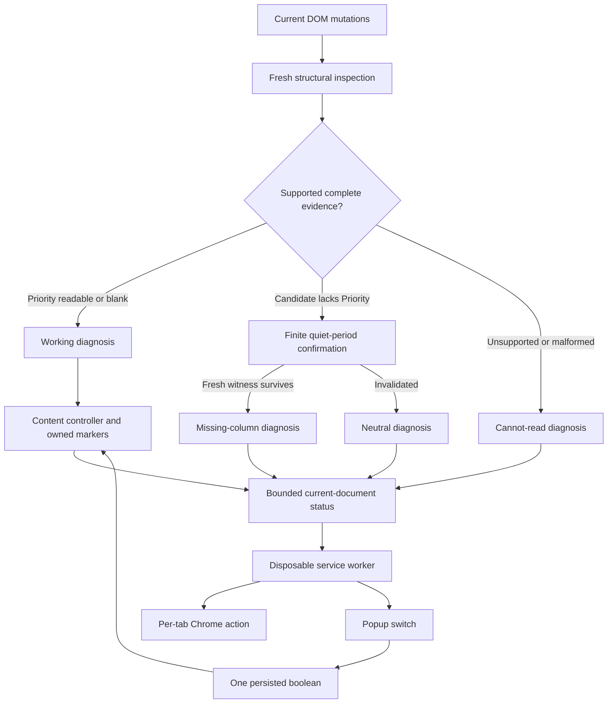

# Phase 04: Honest Failure and an Off Switch - Research

**Researched:** 2026-09-09
**Domain:** Chrome MV3 status, preference ordering, conservative DOM diagnosis
**Confidence:** MEDIUM — official documentation checked; proposed orchestration still needs implementation and browser tests.

<user_constraints>
## User Constraints (from CONTEXT.md)

The following blocks are copied verbatim from the phase context. [CITED: .planning/phases/04-honest-failure-and-an-off-switch/04-CONTEXT.md]

<!-- DATA_82c4f1a9_START -->
## Implementation Decisions

### Missing-Column Certainty — User-Selected

- **D-01:** "This view has no Priority column" may be claimed only when **all three** hold: the candidate table has a well-formed header row (non-zero header cells, all passing the existing malformed-cell check) with no cell whose trimmed text is exactly `Priority`; **and** at least one ticket row is present whose cell count matches the header count, proving the table is genuinely rendered rather than mid-mount; **and** no interpretation-affecting mutation has landed for a settle period. Until all three hold, the state is neutral — never a missing-column claim. Accepting a brief neutral state on views that genuinely lack the column is the deliberate trade for never accusing wrongly.

  Today `inspectCandidateTable` returns `waiting` for seven distinct situations — absent table, absent `thead`/`tbody`, empty header row, zero header cells, headers present with no `Priority` cell, rows with fewer cells than headers, and zero entries. Only the fifth is a missing column. The state model must separate that case out; `waiting` must never be treated as proof of a missing column.

- **D-02:** A Priority column that is present and unambiguous but whose every readable cell is empty (today's `blank` state) reports as **working** on the toolbar. The popup adds one honest line to the effect that a Priority column was found but these tickets have no priority values set, so an agent looking at a colourless list gets an answer instead of assuming breakage. This keeps the toolbar at exactly the three states FAIL-01 commits to and puts the nuance where there is room for it. It never reads as a missing column (Phase 2 D-05).

  Phase 1 evidence makes this a realistic case, not an edge case: the observed ungrouped live view had 7 readable priorities against 23 empty-or-unreadable cells, and the grouped-long view 6 against 24.

- **D-03:** The add-a-Priority-column hint appears in the **popup only**. The distinct toolbar icon state is the entire in-toolbar signal — FAIL-05 already requires that state to look different — and no hint, banner, badge overlay or other diagnostic UI is written into the Zendesk page. This reconciles PROJECT.md's "unobtrusive hint" (which does not say where) with ROADMAP Phase 4 success criterion 1 ("opening the popup tells the agent to add the column"), and preserves FAIL-04, Phase 2 D-06 and Phase 3 D-06 with no exception carved out. Record the reconciliation so the ambiguity does not resurface. — **Reversibility:** costly — undoing it means amending FAIL-04's "page left visually untouched", re-opening the no-page-diagnostic-UI decisions in both Phase 2 and Phase 3, and adding a DOM-construction path to a runtime whose contract test currently asserts the shipped source contains no `createElement`, `innerHTML`, `insertAdjacentHTML` or `.style` write at all.

- **D-04:** Structural unreadability and unsupported locale **share** the third toolbar state ("cannot read this view"), preserving FAIL-01's three-state commitment. The **popup wording branches on the actual evidence**: it names the interface language only when `document.documentElement.lang` genuinely is not `en`, and otherwise says it cannot read this view's ticket table. An English agent whose view broke structurally is never told their language is unsupported, and neither branch ever produces a missing-column claim (FAIL-03).

  The structural family includes everything today's `unsafe` covers besides locale: more than one candidate table, nested or ancestor tables, foreign children of the table element, more than one `thead`/`tbody`/header row, malformed header or body cells, two headers reading `Priority`, a non-empty unrecognised priority value, and anomalous group-row topology. The locale family is `document.documentElement.lang !== 'en'` and the non-top-frame guard.

### Carried-Forward Constraints — Not Reopened

- **D-05:** The permission surface stays frozen at `"permissions": ["storage"]`, no `host_permissions` block, and `matches` of exactly `https://*.zendesk.com/agent/*`. Adding the `action` manifest key, icon assets, a popup document and (if needed for per-tab icon state) a service worker introduces **no new permission entry** — `chrome.action` and `chrome.runtime` messaging require none. Any plan that would add a permission entry is out of bounds and must stop for the user.
- **D-06:** Persist exactly one boolean. No ticket content is persisted, transmitted or logged. No network calls, no telemetry, no remote code, no build step or bundler — shipped bytes equal repository bytes and the source stays unminified.
- **D-07:** The product palette stays entirely in `extension/zhroma.css`, driven by the single `data-zhroma-priority` attribute. Shipped extension JavaScript contains no colour values and writes no CSS. Phase 4 adds no new tint, no fifth colour and no alternative treatment.
- **D-08:** The English boundary holds: `html[lang="en"]` shell, exact trimmed labels `Priority`, `Urgent`, `High`, `Normal`, `Low`. Phase 1 established that **no locale-independent priority signal exists** in the observed DOM, so the unsupported-language state is a permanent v1 property, not a gap to engineer around.
- **D-09:** Retain mutation-driven discovery. No SPA route hooks, no history patching, no `webNavigation`, no navigation permissions. Unsupported states preserve native page behaviour.
- **D-10:** A persistent user-off state must remain distinct from the existing temporary hidden/`pagehide` pause, so a tab switch, background/foreground cycle or bfcache restore can never silently undo or override the user's stored preference in either direction.
- **D-11:** The popup stays a status panel plus one switch. "Any options page beyond the on/off toggle" is explicitly out of scope, and zero-config on install is the product's wedge.

### Claude's Discretion

- The internal state model and naming that replaces today's `safe` / `waiting` / `unsafe` / `blank` return values, and how the settle window is implemented, as long as D-01's three conditions are what gate the missing-column claim.
- The settle-window duration. No user constraint was given; choose and justify it against the existing measured budget rather than asking. Note the existing runtime-contract test asserts timers drain to zero (`expect(vi.getTimerCount()).toBe(0)`) — a settle timer must satisfy that, and must not become a resetting loop against the page.
- The messaging seam between content script, popup and any service worker; module and file organisation; test organisation. Constrained by D-05, D-06 and the no-build rule.
- Exact popup copy, within D-02's, D-03's and D-04's required distinctions.
<!-- DATA_82c4f1a9_END -->

<!-- DATA_5d03b8e6_START -->
## Deferred Ideas

### Offered but not discussed — unresolved, in scope for this phase

These are **not** decided and **not** delegated. Research and planning must resolve them against the invariants above and surface the choices; a `checkpoint:decision` before implementing them is appropriate.

- **Toolbar state vocabulary** — whether the three states read as three distinct icon artworks, one icon plus a badge, or another treatment; what the toolbar shows when the switch is OFF and when the tab is not a Zendesk agent view (the roadmap names three states; there are arguably five). This also determines how much icon artwork has to exist, which is a real cost with no designer on the project and which overlaps Phase 5's required 128×128 store icon.
- **Toggle scope and immediacy** — global versus per-tab; whether other open Zendesk tabs clear immediately or on next focus; `storage.local` versus `storage.sync`. Bounded by D-06 (exactly one boolean), D-10 (user-off distinct from visibility pause) and CTRL-03/CTRL-04.
- **Popup contents and boundary** — the actual copy for the five messages, whether it offers step-by-step instructions for adding a Priority column or an outbound link to Zendesk documentation, and what it shows when the active tab is not a Zendesk agent view. Bounded by D-11 (status panel plus one switch, never an options page).

### Out of this phase

None newly introduced. Preserve existing scope: Phase 3 retains ongoing liveness and FAIL-04 page cleanup; Phase 5 retains public publication, privacy policy and the pre-submission checklist; v2 retains dark mode, the colourblind-safe palette, custom colours, alternative visual treatments and additional locales.
<!-- DATA_5d03b8e6_END -->
</user_constraints>

## Summary

Build a small content-script diagnosis layer, a disposable service-worker toolbar adapter, and a static popup. Keep the content controller authoritative for present DOM evidence and storage authoritative for the sole preference. Existing cleanup and observation are reusable; the current absent-header return happens before body validation and cannot establish D-01. [VERIFIED: extension/content.js:43-73] Verbatim existing returns: `return result('waiting', table)` and `return result(entries.some((entry) => entry.priority !== null) ? 'safe' : 'blank', table, entries)`.

A finite quiet period establishes the user-selected operational criterion, not proof that Zendesk will never mutate again. Withdraw a confirmed diagnosis immediately on interpretation changes, then establish it again from a fresh inspection. Do not advertise certainty stronger than D-01. [CITED: .planning/phases/04-honest-failure-and-an-off-switch/04-CONTEXT.md]

**Primary recommendation:** Implement the evidence and ordering seams first, with an explicit decision checkpoint before toolbar treatment, toggle scope/storage area, and popup boundary become adopted product decisions. Phase 3 remains `human_needed`, 28/34, with nine live checks untested; do not restart its UAT. [CITED: .planning/phases/03-the-tint-survives-everything/03-HANDOFF.md]

## Architectural Responsibility Map

The following is a recommended allocation within the context's delegated implementation discretion, not a new product decision. [CITED: .planning/phases/04-honest-failure-and-an-off-switch/04-CONTEXT.md]

| Capability | Primary tier | Secondary tier | Rationale |
|---|---|---|---|
| Inspect table, establish missing-column evidence | Content script | — | Owns live DOM and mutation revisions |
| Clear/reapply tint | Content script | CSS | Existing ownership cleanup and stylesheet seam |
| Persist preference | Chrome storage | Popup writes | One boolean survives restart |
| Per-tab toolbar projection | Extension service worker | Content script | Receives bounded diagnosis, sets action |
| Explain status and request toggle | Popup | Worker/content script | Static extension document, no page UI |
| Navigation/suspension recovery | Worker and content lifecycle | Chrome events | Fresh handshake, disposable caches |

<phase_requirements>
## Phase Requirements

Descriptions copied from requirements; support columns are research recommendations. [CITED: .planning/REQUIREMENTS.md]

| ID | Description | Research support |
|---|---|---|
| FAIL-01 | Extension distinguishes three states — tinting normally, the view has no Priority column, and priority values are unreadable in this agent's locale | Separate diagnosis from operational off/waiting states; blank maps to working |
| FAIL-02 | When a view genuinely has no Priority column, an unobtrusive hint tells the agent to add one — shown only when that diagnosis is certain | D-01 structural witness plus quiet period; popup only |
| FAIL-03 | When priority values cannot be read because the agent's locale is not supported, no hint claiming a missing column is shown | Locale and structural failure separate popup causes |
| FAIL-05 | The agent can see which of the three states applies from the toolbar icon, without opening anything | Per-tab action projection; artwork decision gate |
| CTRL-02 | Agent can turn tinting off and back on from the toolbar popup | Native labelled checkbox/switch, confirmed preference |
| CTRL-03 | The on/off setting persists across browser restarts | One stored boolean, absence means default on |
| CTRL-04 | Turning tinting off clears tints from the current view without requiring a page refresh | Reuse teardown; acknowledge current-document application |
</phase_requirements>

## Project Constraints (from project instructions)

No root AGENTS.md or CLAUDE.md and no project .agents/skills or .codex/skills directories were found by the session inventory. The configured instruction source is .claude/CLAUDE.md. Its actionable workflow directive requires GSD context before editing; this research is inside the authorized plan-phase workflow. Its generated stack material repeats older research and must yield to current context/source. No configured researcher skills were returned by the agent-skills seam. [VERIFIED: session filesystem inventory and agent-skills command]

Preserve no-build source, frozen permissions, no network/logging/ticket storage, CSS-only palette, exact English parsing, and user-controlled authenticated interactions. Do not adopt the old generated suggestions to omit action/background/storage, widen matches, log debug data, or install optional tooling. [CITED: .claude/CLAUDE.md; .planning/phases/04-honest-failure-and-an-off-switch/04-CONTEXT.md]

## Standard Stack

Reuse the installed development stack; this phase requires no package installation or upgrade. Package latest versions and publish dates are deliberately not a selection input because no new version is proposed. Exact installed versions were confirmed with npm ls. [VERIFIED: package.json:13-16] Verbatim: `"happy-dom": "20.13.1"`, `"vitest": "4.1.11"`.

| Component | Version | Use |
|---|---|---|
| Native Chrome extension APIs | MV3; action available Chrome 88+ | Worker, popup, storage and messaging |
| Plain JavaScript, HTML, CSS | Repository source, no transform | All shipped surfaces |
| Existing Vitest / happy-dom | Exact quoted versions above | Actual-source controller, popup and worker tests |
| Node built-in test and VM | Installed Node v26.8.1 | Existing smoke and isolated script tests |

Chrome action availability is documented officially. Node and dependency values above are session command observations, not a new minimum-version decision. [CITED: https://developer.chrome.com/docs/extensions/reference/api/action] [VERIFIED: node --version; npm ls --depth=0]

**Package Legitimacy Audit:** No installs recommended; no new audit gate needed. Preserve existing exact-version approvals and the accepted historical independence exception. [CITED: DEPENDENCY-APPROVALS.md; .planning/phases/01-dom-recon-spike/01-RISK-ACCEPTANCE.md]

## Architecture Patterns

### System architecture

Recommended data flow under the context's implementation discretion. [CITED: .planning/phases/04-honest-failure-and-an-off-switch/04-CONTEXT.md]



### 1. Separate evidence, operational state, and presentation

Use a finite internal diagnosis with no raw DOM strings in messages. Keep user preference, initialization readiness and visibility/pagehide pause as independent inputs. Only their conjunction permits running. Off, waiting and unavailable are operational states; their toolbar treatment is unresolved and must not silently enlarge or collapse the three product diagnoses. [CITED: phase context D-01, D-02, D-04, D-10 and unresolved toolbar decision]

The current language/top-frame guard is `document.documentElement.lang !== 'en' || window.top !== window`; marker and recognized labels are `'data-zhroma-priority'` and `['Urgent', 'High', 'Normal', 'Low']`. Preserve these values. [VERIFIED: extension/content.js:4-5,23-25] Missing/empty language evidence must use generic unsupported/cannot-read copy rather than inventing an actual language name. Do not send raw lang values just to interpolate them in the popup; a fixed reason is sufficient. [CITED: phase context D-04, D-06, D-08]

### 2. Finite certainty without a retry loop

Implementation recommendation: choose a **100 ms** quiet period for missing-column confirmation only. This is a delegated timer choice, not a measured Zendesk settling guarantee. It delays the hint without delaying normal positive tint passes; evaluate CPU separately against the inherited budgets. [CITED: phase context Claude's Discretion; .planning/phases/03-the-tint-survives-everything/03-CONTEXT.md D-11]

Validate shared table topology before branching on header presence. Require at least one valid direct ticket row matching header width; group-only/empty/incomplete bodies remain neutral. Reject malformed topology and duplicate headers before any positive diagnosis. Do not infer missing from the old waiting state. [VERIFIED: extension/content.js:34-73] Existing verbatim branch: `if (indexes.length === 0) return result('waiting', table);`.

Track a mutation revision and last relevant change time. Arm one confirmation timer only for an eligible candidate. On relevant change invalidate published confirmation synchronously and update the revision; retain at most one pending timer. At callback, inspect fresh DOM; if the quiet interval has not elapsed, schedule only the remaining interval. No callback should schedule itself after confirmation or loss of eligibility. Cancel the timer on off/pause and candidate replacement; no retained DOM snapshot crosses a timer boundary. Ignore self-marker records and unrelated mutations. [CITED: phase context D-01 and delegated settle implementation; existing ownership pattern in extension/content.js]

A source-bound test must prove bounded pending timers during a sustained finite mutation burst and zero at rest, including missing-column views. Existing assertion is `expect(vi.getTimerCount()).toBe(0)`. [VERIFIED: test/extension/runtime-contract.test.js:78-81,99-103]

### 3. Worker is an adapter, not a database

Register listeners synchronously at worker top level. On wake, read the boolean and request a current content-script diagnosis; do not initialize preference solely in onInstalled or trust a prior global map. Worker termination discards globals and normally occurs after 30 seconds idle. No ports, alarms, polling or artificial keepalive are needed. [CITED: https://developer.chrome.com/docs/extensions/develop/concepts/service-workers/lifecycle] [CITED: https://developer.chrome.com/docs/extensions/get-started/tutorial/service-worker-events]

Store no per-tab diagnosis in any storage area, including session. Keep only disposable per-tab request generation/in-flight state; release on tab removal. Query active tab identity without URL/title filtering, then perform a bounded top-frame handshake. No receiver means unavailable/unconfirmed, never missing-column or definitively non-Zendesk. [CITED: https://developer.chrome.com/docs/extensions/reference/api/tabs] [CITED: phase context D-05,D-06]

Always set per-tab action values with a tab ID. Tab-specific action settings override global ones; global off updates alone cannot override existing per-tab projections. A popup declaration also means action.onClicked is not the switch handler. Use the popup control. [CITED: https://developer.chrome.com/docs/extensions/reference/api/action]

### 4. Stale messaging and navigation

Treat content pushes as invalidation hints that trigger a fresh top-frame request, rather than directly trusting a delayed pushed diagnosis. Use generation checks around every await and serialize action updates per tab so a slow earlier response cannot overwrite a later status. Validate sender extension ID, top frame and schema; derive tab identity from Chrome sender metadata rather than a payload-supplied tab ID. [CITED: https://developer.chrome.com/docs/extensions/reference/api/runtime] [CITED: phase context delegated messaging seam]

Chrome exposes sender documentId and permits document-targeted messaging from Chrome 106. If using that seam, document the compatibility floor rather than retaining the old “all APIs are Chrome 88-era” claim. Do not assume a documentId proves it is still the active document; requery the current top frame and reject stale generations. [CITED: https://developer.chrome.com/docs/extensions/reference/api/runtime] [CITED: https://developer.chrome.com/docs/extensions/reference/api/tabs]

Use tabs.onActivated and loading/completion events only to invalidate/requery toolbar state; never detect SPA routes or trigger tinting from URL parsing. DOM mutation remains the view-discovery mechanism. Test navigation, tab closure, bfcache, worker restart and delayed response races. Chrome action navigation reset is not asserted here: the current reference did not establish that behavior. Explicitly invalidate rather than relying on it. [CITED: https://developer.chrome.com/docs/extensions/reference/api/tabs] [CITED: phase context D-09]

### 5. Preference startup and toggle ordering

Register storage change listeners before starting an asynchronous read. Remain untinted until a valid read completes; a stored false must never flash enabled tint. Use a read generation so an earlier storage response cannot overwrite a later onChanged event. Normalize only an absent key to default on; storage failure is not absence. Preserve user-off through every lifecycle path. [CITED: phase context D-06,D-10 and CTRL-03/04]

Recommend one serialized preference writer and idempotent requests for the desired boolean, not “invert whatever you last saw.” Do not persist a revision, timestamps or per-tab values. After write success, ask the current document to read/apply the persisted value, and acknowledge only after its cleanup/reconciliation completes. The onChanged listener is the cross-context convergence path; explicit current-tab acknowledgement establishes CTRL-04. Disable repeated popup input while a request is outstanding; closing/reopening reconstructs truth from storage. Storage read/write failure must produce honest popup feedback, no success claim and no page diagnostic. [CITED: https://developer.chrome.com/docs/extensions/reference/api/storage] [CITED: phase context D-06,D-10]

The DOM clear can be synchronous once the off preference is received; persistence and cross-process delivery cannot be one atomic transaction. Test the interleavings rather than claiming platform atomicity. Make commitSnapshot communicate success/failure before reporting working: current rollback catches errors without returning an outcome. [VERIFIED: extension/content.js:110-139] Verbatim failure control: `catch { clearOwnedMarkers(); }`.

## Decisions Still Required

These recommendations are **not adopted decisions**; keep a decision checkpoint before implementing them. [CITED: phase context Deferred Ideas]

| Area | Recommended option | Credible alternative and tradeoff |
|---|---|---|
| Toolbar vocabulary | Distinct static icon shapes for the three diagnoses; approved neutral/off treatment plus explanatory title | Badge vocabulary reduces asset count but needs clear glyph semantics; badge color literals must not violate JS palette separation |
| Scope/immediacy/storage | One global preference in storage.local; current tab immediate acknowledgement; other runnable tabs onChanged, frozen tabs on resume | sync offers cross-device settings but Chrome transmits the boolean when sync is enabled; explicit user decision must reconcile that with zero-network positioning. Per-tab persisted choices require more than one boolean unless only a global default persists, which changes the UX |
| Popup boundary | Five concise required messages plus operational pending/off/unavailable copy, one labelled switch, no outbound link | Short steps can help add the column; exact steps need current Zendesk documentation. A link is a user-initiated outbound navigation and must be decided, not silently added |

Chrome sync behavior is documented; a frozen tab cannot execute handlers/timers until unfrozen. Therefore promise immediate current-view cleanup and runnable-tab convergence, not physical execution in every frozen tab. [CITED: https://developer.chrome.com/docs/extensions/reference/api/storage] [CITED: https://developer.chrome.com/docs/extensions/reference/api/tabs]

Suggested copy for checkpoint review: “Priority tinting is working”; “Priority column found. These tickets have no priority values set”; “Add a Priority column to this view to use tinting”; “This interface language is not supported”; “Zhroma cannot read this view's ticket table.” Operational copy: “Tinting is off”, “Checking this view”, “No readable view is connected.” These are proposed strings, not existing enums or user approvals. [CITED: phase context D-02 through D-04 and unresolved popup boundary]

## Don't Hand-Roll

| Problem | Use instead | Reason |
|---|---|---|
| Browser persistence | Chrome storage API | Existing permission; no web-storage workaround |
| Cross-context communication | runtime and tabs messaging | No page event bridge or server |
| DOM cleanup | Existing owned-marker controller | Avoid a second ownership system |
| Popup rendering | Static packaged HTML, textContent, native labelled input | No framework, remote resources or HTML injection |
| Worker lifetime | Event-driven reconstruction | Avoid heartbeat or long-lived port workaround |

These recommendations derive from locked boundaries and the official API contracts above. [CITED: phase context D-05 through D-11; Chrome API sources]

## Common Pitfalls and Test Targets

- **Conflating waiting with missing:** absent table, partial mount, empty/group-only body, malformed headers and unsupported locale must never show the hint; test every branch and quiet-window invalidation. [CITED: phase context D-01]
- **Truthiness drops false:** explicitly inspect whether the boolean key changed; do not copy the documentation's truthy debug example into an off switch. [CITED: https://developer.chrome.com/docs/extensions/reference/api/storage]
- **Old startup read wins:** delayed read after off event must not enable; failed reads must not overwrite stored state. [CITED: phase context D-10]
- **False working after rollback:** report an operational failure when marker writes fail; blank is working only after full valid interpretation. [VERIFIED: extension/content.js:110-139] Verbatim caught path: `catch { clearOwnedMarkers(); }`.
- **Global icon leaks across tabs:** test two tabs with different diagnoses, focused-window changes, worker recreation and tab closure. [CITED: https://developer.chrome.com/docs/extensions/reference/api/action]
- **No receiver misdiagnosed:** extension reload, navigation or no content script is unavailable, not missing-column evidence. [CITED: phase context D-01; Chrome tabs messaging documentation]
- **Broad mock bypass:** narrow storage and messaging sentinels to exact shapes; continue denying network, logs, other stores and ticket payloads on every new surface. [VERIFIED: test/extension/runtime-contract.test.js:61-79] Verbatim expected outcome: `expect(forbiddenCalls).toEqual([])`.
- **Historical evidence breaks on edit:** current Phase 3 test reads live source bytes and hashes them. Bind that record to its historical source, following Phase 2's pattern; preserve its pending outcomes and create separate Phase 4 evidence. Never regenerate a “passed” record for changed bytes. [VERIFIED: test/extension/phase-03-live-acceptance.test.js:12-17] Verbatim: `const source = asset('content.js');`. [CITED: test/extension/live-acceptance.test.js; 03-HANDOFF.md]
- **Overstated test-discovery change:** current config already includes new extension tests matching `'test/extension/*.test.js'`; no config edit is needed for that naming pattern, despite context's stale wording. [VERIFIED: vitest.config.js:4-7] Verbatim: `include: ['test/recon/*.test.js', 'test/extension/*.test.js']`.

## Code Examples

API examples below are illustrative, with caller-provided values rather than proposed persisted keys or message enums. Use the callback pattern because Chrome says Promise listener support is still rolling out from Chrome 148. [CITED: https://developer.chrome.com/docs/extensions/develop/concepts/messaging]

```js
chrome.runtime.onMessage.addListener((message, sender, sendResponse) => {
  if (!isAllowed(message, sender)) return;
  handleAllowedMessage(message, sender).then(sendResponse, () => {
    sendResponse(unavailableResponse());
  });
  return true;
});
```

Current-tab query and targeted request shape; catch failures as unavailable and use request generations around the awaits. [CITED: https://developer.chrome.com/docs/extensions/reference/api/tabs]

```js
const [tab] = await chrome.tabs.query({ active: true, currentWindow: true });
if (Number.isInteger(tab?.id)) {
  const reply = await chrome.tabs.sendMessage(tab.id, request, { frameId: 0 });
  // Validate reply and request generation before rendering.
}
```

## Runtime State Inventory

This phase refactors controller state rather than renaming a deployed identifier. Inventory is limited to inspected repository state; no authenticated service or OS audit was performed. [VERIFIED: session scope and source inspection]

| Category | Items found / uncertainty | Action |
|---|---|---|
| Stored data | Existing runtime has no storage calls; new preference is first use | No demonstrated migration; never persist diagnoses |
| Live service config | No server added by this phase; external Zendesk config not inspected | Do not modify operational views |
| OS-registered state | Unpacked extension registration may exist; not inspected | Reload only during authorized Phase 4 checks |
| Secrets/env vars | No new credential dependency; private environment values not inspected | No rename or migration proposed |
| Build artifacts/installed packages | Existing two approved dev dependencies; no build step | No install; preserve historical source evidence |

Runtime storage-channel prohibition is directly tested. [VERIFIED: test/extension/runtime-contract.test.js:63-79] Verbatim: `chrome: { storage }, browser: { storage }` and `expect(forbiddenCalls).toEqual([])`.

## State of the Art

| Older source claim | Current planning treatment | Evidence |
|---|---|---|
| Omit action, background and storage | Phase 4 explicitly owns these capabilities | [CITED: phase context D-05,D-06] |
| Async message listeners never support Promises | Support is rolling out; literal true remains robust | [CITED: Chrome messaging docs] |
| No APIs newer than Chrome 88 | documentId would establish a newer API floor | [CITED: Chrome runtime/tabs docs] |
| Context7 pageAction example | Reject MV2 snippet; use current action reference | [VERIFIED: session Context7 result and official action lookup] |

## Environment Availability

| Dependency | Observed availability | Fallback/limit |
|---|---|---|
| Node | v26.8.1 | Session CLI probe |
| npm | 11.19.0 | Session CLI probe |
| Test dependencies | Installed exact approved versions | No install required |
| Google Chrome executable | 153.0.8010.37 | This is executable version, not proof of loaded browser session version |
| Authenticated live view | Not probed | User-owned live checks; no Phase 3 restart |
| Research cache | Write failed with EPERM outside workspace | Findings retained in this report |

Version rows are session command observations. Historical Phase 3 environment reports Chrome 152; do not relabel those observations as Chrome 153 or assume the running browser has restarted. [VERIFIED: session availability commands] [CITED: 03-HANDOFF.md]

## Security Domain

Security is enabled and Nyquist validation is explicitly disabled, so no Validation Architecture section is emitted. [VERIFIED: .planning/config.json:24-24,47-49] Verbatim: `"nyquist_validation": false`, `"security_enforcement": true`, `"security_asvs_level": 1`, `"security_block_on": "high"`.

OWASP currently identifies ASVS 5.0.0 and recommends version-qualified requirement IDs. The old generic V2-authentication/V3-session/V4-access/V5-validation template is not silently presented as ASVS 5 numbering. Use named domains below, and pin the chosen ASVS version before assigning detailed requirement IDs. [CITED: https://owasp.org/www-project-application-security-verification-standard/]

| Applicable security domain | Applicability and control |
|---|---|
| Authentication/session | No new login/session implementation; never access Zendesk credentials/cookies |
| Authorization/trust boundary | Validate runtime sender, top-frame identity and finite message schema; no external messaging endpoint |
| Input validation/output encoding | Allowlist primitive state, desired boolean and bounded metadata; render fixed copy with textContent |
| Data protection | One boolean only; no ticket strings, URLs, DOM, lang strings or errors in logs/storage/messages |
| Browser configuration | Preserve static isolated injection and frozen permissions; packaged popup scripts/assets |
| Cryptography | No new cryptographic feature; no custom cipher/token handling |

This is a phase-specific threat mapping, not security attestation. [CITED: phase context D-05 through D-09]

| Threat | STRIDE | Planned mitigation / proof |
|---|---|---|
| Forged/stale diagnostic | Spoofing / Tampering | Sender validation, fresh top-frame handshake, generation race tests |
| Ticket payload crosses boundary | Information disclosure | Exact schema and forbidden-channel sentinels on content/worker/popup |
| Old response enables after off | Tampering | Read generations, serialized desired-value writes, delayed-resolution tests |
| Worker kept awake / mutation storm | Denial of service | No heartbeat, finite settle scheduling, zero timers at rest |
| Popup HTML injection | Tampering | Fixed text, native input, no page-provided markup |

## Assumptions Log

| ID | Claim requiring confirmation | Risk |
|---|---|---|
| A1 | [ASSUMED] User will prefer global local-storage behavior over sync or per-tab scope | Wrong scope if adopted without decision |
| A2 | [ASSUMED] Distinct static icons and neutral/off treatment will meet the desired toolbar vocabulary | Artwork/meaning rework |
| A3 | [ASSUMED] Concise popup copy with no external help link is preferred | Help boundary may differ |

The 100 ms timer is a delegated implementation choice, not a factual assumption about Zendesk. Validate it in tests and finite browser timing; do not ask for a new user decision about its numeric value. [CITED: phase context Claude's Discretion]

## Open Questions

1. Resolve the three decision areas above before dependent implementation. Planning can proceed with explicit checkpoints. [CITED: phase context Deferred Ideas]
2. Whether loaded Chrome's real action lifecycle, multi-tab ordering and visual distinction satisfy the implementation remains untested; require new-source Phase 4 evidence without restarting Phase 3. [CITED: 03-HANDOFF.md; phase context]
3. A permanent native attribute-removal failure cannot guarantee visible cleanup; retain the inherited disclosed platform limit and do not report successful off application after failed cleanup. [VERIFIED: extension/content.js:87-107] Verbatim: `catch { complete = false; }`.

## Sources

- All canonical references listed in 04-CONTEXT.md were read: roadmap, requirements, project, Phase 3 handoff/verification/live acceptance/context, earlier contexts/risk acceptance, selectors, fixture manifest, approvals, and original architecture/pitfalls/stack.
- Current source and runtime/persistent/initial/Phase 2/Phase 3 acceptance test seams were inspected directly.
- [Chrome action](https://developer.chrome.com/docs/extensions/reference/api/action): action declaration, tab-specific state and popup behavior.
- [Chrome tabs](https://developer.chrome.com/docs/extensions/reference/api/tabs): permissions, current-tab query, messaging, document targeting, frozen tabs.
- [Chrome storage](https://developer.chrome.com/docs/extensions/reference/api/storage): local/sync, change events, asynchronous operations.
- [Chrome runtime](https://developer.chrome.com/docs/extensions/reference/api/runtime): sender metadata and document identity.
- [Worker lifecycle](https://developer.chrome.com/docs/extensions/develop/concepts/service-workers/lifecycle): suspension and lost globals.
- [Worker events](https://developer.chrome.com/docs/extensions/get-started/tutorial/service-worker-events): synchronous registration.
- [Messaging](https://developer.chrome.com/docs/extensions/develop/concepts/messaging): asynchronous response compatibility.
- [OWASP ASVS](https://owasp.org/www-project-application-security-verification-standard/): current version and version-qualified IDs.
- Context7 library /websites/developer_chrome_extensions; two questions routed through research-plan. Its pageAction result was rejected in favor of current official action documentation.

## Metadata

Confidence seam returned MEDIUM for Context7 with and without cross-verification; webfetch returned LOW even with cross-verification. Official web pages are therefore tagged CITED rather than upgraded on provider reputation. Source definitions opened in this session have precise VERIFIED code citations and verbatim values. Proposed coordination patterns still require adversarial tests; this report claims research completion, not implementation or human acceptance.

Research-store cache writes failed with EPERM; no escalation was needed because the canonical report retains the findings. No packages, production edits, commits, UAT interactions or acceptance changes were performed. Review API details again if implementation is delayed beyond 30 days; this is a review interval, not a support guarantee.
