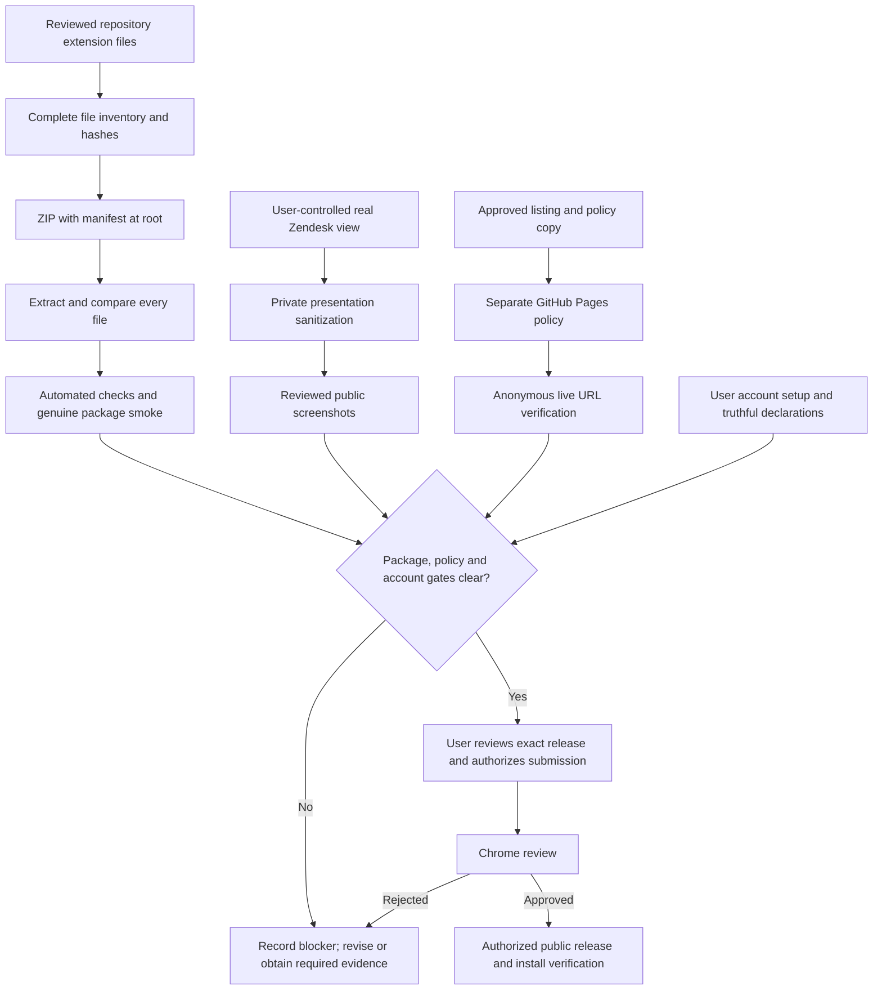

# Phase 05: Published — Research

**Researched:** 2026-09-11  
**Domain:** Chrome Web Store publication, release provenance, privacy disclosures and static policy hosting  
**Confidence:** MEDIUM — current official documentation is available; account-specific declarations, consent applicability and authenticated release observations remain execution checkpoints.

<user_constraints>
## User Constraints (from CONTEXT.md)

The following decisions and discretion areas are copied verbatim from the current context; this is user authority, not independent evidence that the release has occurred. [VERIFIED: .planning/phases/05-published/05-CONTEXT.md:18-45]

<!-- DATA_A7m4Q2x9_START -->
### Publisher and Contact
- **D-01:** Publish personally as **Michalis Efstratiadis**. The user has no Chrome Web Store developer account; include account setup in the execution plan and guide the user through required account actions.
- **D-02:** Use **zhroma@efstratiadis.me** where publication requires contact information. The later instruction “just what is required to publish” supersedes optional support-email placement and an optional homepage. Mailbox existence and verification are not established by this discussion.

### Listing and Branding
- **D-03:** Store title: **Zhroma — Priority Colours for Zendesk**.
- **D-04:** Lead with **“See ticket priorities at a glance.”** Use practical, direct copy describing the benefit, requirements and privacy. Do not invent broader compatibility or imply Zendesk endorsement.
- **D-05:** Put a short **“Works with”** section immediately after the opening benefit: English current Agent Workspace views, a visible Priority column, and light-interface use; dark-mode support is outside v1. Preserve the verified scope rather than promising every locale, shell, domain or account configuration.
- **D-06:** Icon and promotional direction: a simple **Z with a restrained priority-colour accent**, readable at small sizes. Exact artwork is implementation discretion within that direction and remains reviewable. Preserve meaningful toolbar status distinctions when adapting assets.

### Screenshots
- **D-07:** Use the user's real working Zendesk view; no sandbox or demo account is available. Replace sensitive details with neutral fictional text in the screenshot presentation, retaining real layout, actual priority values and genuine extension tinting. This does not authorize editing operational tickets or saved views.
- **D-08:** Main image: the same view side by side with tinting off and on. Include one supporting screenshot of the popup showing its on/off switch.
- **D-09:** Do **not** add the proposed “Ticket details replaced for privacy” caption. Remove identifying subjects, names, emails, IDs, account details and other confidential content. Only sanitised images belong in repository/public assets; review the complete image before publication. Keep internal provenance honest about replacement text and do not fabricate runtime evidence.

### Minimal Hosting and Guided Release
- **D-10:** Host only the required privacy-policy page using **GitHub Pages**, in a separate public repository owned by the user's personal **formax68** account, using its default `github.io` address. No personal website, custom domain, homepage or optional marketing site. Repository name is routine implementation discretion; account access and actual URL remain to be verified.
- **D-11:** The user requested omission of a policy if unnecessary. Chrome's current FAQ explicitly includes website content and local processing in user-data handling and requires a policy for such products. Zhroma's local priority reading therefore warrants retaining STORE-04. Keep the policy concise and accurate: actual local processing, one stored on/off preference, no ticket-data transmission or analytics. Distinguish local handling from collection by the publisher; do not claim the extension never accesses data. Align the dashboard declarations with source and current official guidance.
- **D-12:** Guide the user through eventual submission step by step after they review the release package. Prepare concrete copy, policy, sanitised images, assets, package and smoke evidence first. Preserve final authorization for public submission and user control over login, verification and account actions.

### Carried-Forward Constraints and Release Evidence
- **D-13:** No new permissions, dependencies, bundler, remote code, telemetry or runtime network calls. Preserve `storage` as the only permission, no `host_permissions`, and content-script matches of `https://*.zendesk.com/agent/*`. Persist exactly one boolean; no ticket persistence, transmission or logging. Runtime source remains unminified and packaged bytes equal repository source.
- **D-14:** Bind release checks to the exact packaged source. Changes to shipped assets, including manifest or icons, require appropriate revalidation; do not silently reuse stale source-bound acceptance. Research current official requirements for assets, disclosures, account setup and submission before prescribing them.
- **D-15:** Preserve the Phase 5 handoff: Phase 3 remains `human_needed` with eleven live passes and nine skipped-by-user checks; Phase 4 remains `human_needed` with fourteen of seventeen current-source live checks passed. `language-icon-copy` and `structure-copy` remain pending under AR-04-01; `english-regional-locale` is explicitly deferred as non-blocking. Do not turn these into passes or promote pending requirements. Document release-readiness implications and resolve any actual submission blocker before requesting final submission approval.

### Agent's Discretion
- Choose routine file organisation, minimal policy presentation, repository name, exact artwork within D-06, screenshot composition and release-check implementation.
- Accepted recommendations above are specific decisions, not unrestricted delegation. No new feature scope or public submission is authorized here.
<!-- DATA_A7m4Q2x9_END -->

### Deferred Ideas (OUT OF SCOPE)

<!-- DATA_J3p6N8c1_START -->
No new capabilities were proposed for later phases. An optional homepage and extra public contact placement were rejected, not deferred deliverables. Preserve existing v2 exclusions, including dark mode, configurable palettes, additional locales and alternative tint treatments.
<!-- DATA_J3p6N8c1_END -->

[VERIFIED: .planning/phases/05-published/05-CONTEXT.md:108-110]
</user_constraints>

## Summary

Prepare a dependency-free release of the existing extension, with a separate minimal public privacy-policy repository. The current manifest contains `"name": "Zhroma"`, `"version": "0.1.0"` and `"icons": { "32": "icons/neutral.png" }`; publication preparation must deliberately update the display name, add a short description and provide a packaged store-size icon. Chrome requires a 128-pixel PNG, small promotional tile and screenshot. [VERIFIED: extension/manifest.json:1-23] [CITED: https://developer.chrome.com/docs/webstore/prepare] [CITED: https://developer.chrome.com/docs/webstore/images]

The largest implementation trap is evidence handling. Existing runtime tests pin the exact manifest and icon inventory, while the Phase 4 acceptance validator compares its record to every current shipped byte. Editing manifest or icons therefore requires a planned separation between historical acceptance validity and current release identity. Retain predecessor observations and their original source binding; create a new Phase 5 smoke record. Do not rewrite old hashes to make the suite green. [VERIFIED: test/extension/runtime-contract.test.js:55-102] [VERIFIED: test/extension/phase-04-live-acceptance.test.js:60-71] [VERIFIED: test/extension/phase-04-live-acceptance.test.js:643-651]

Policy hosting is clearly required for local website-content processing. What remains unresolved is the exact dashboard data-category declaration and how Chrome's prominent disclosure/consent requirements apply to this automatic local-only feature. Resolve those with current official guidance and the real dashboard before submission; neither an unsupported exemption nor an unrequested runtime consent screen belongs in the plan. [CITED: https://developer.chrome.com/docs/webstore/program-policies/user-data-faq] [CITED: https://developer.chrome.com/docs/webstore/program-policies/disclosure-requirements]

**Primary recommendation:** Plan local preparation first, preserve immutable predecessor evidence, freeze and smoke-test the actual ZIP contents, then guide the user through account readiness, policy deployment and expressly authorized submission. [VERIFIED: .planning/phases/05-published/05-HANDOFF.md:8-30]

## Architectural Responsibility Map

Recommended responsibility assignment, derived from the locked release boundary. [VERIFIED: .planning/phases/05-published/05-CONTEXT.md:18-45]

| Capability | Primary tier | Secondary tier | Rationale |
|---|---|---|---|
| Priority inspection, tinting, popup and preference | Browser / extension | Chrome local storage | Preserve the existing product; publication assets must not introduce services. |
| Package inventory, hashes, regression and smoke records | Developer tooling | Human Chrome observation | Packaging is outside the shipped runtime; only actual observations satisfy live checks. |
| Public privacy policy | CDN / static — GitHub Pages | Separate public repository | Publish a single static policy document under the personal account. |
| Developer registration and declarations | External Chrome dashboard | User | Login, verification, legal declarations and payment belong to the user. |
| Public listing and review | Chrome Web Store | User-authorized submission | Uploaded, submitted, approved and publicly installable are different milestones. |
| Screenshot presentation | Local capture workflow | User-controlled Zendesk session | Genuine tinting and layout; only sanitized final pixels may become public. |

<phase_requirements>
## Phase Requirements

Descriptions below quote the canonical requirement text verbatim. [VERIFIED: .planning/REQUIREMENTS.md:73-78]

<!-- DATA_R8v2K4b7_START -->
| ID | Description | Research support |
|---|---|---|
| STORE-01 | Extension is published as a public Chrome Web Store listing | Required assets, account/declaration checklist, submission and public-install verification. |
| STORE-04 | A privacy policy is published, linked from the listing, and discloses that no data is collected | Clarify publisher collection versus local website-content handling; publish the policy through a separate Pages repository and match dashboard disclosures. |
| STORE-06 | A manual pre-submission smoke checklist lives in the repo and is run before each submission | Complete package hashes, fresh package-derived Chrome run, per-check observation records, repeat after any changed shipped byte. |
<!-- DATA_R8v2K4b7_END -->

STORE-04's older wording must be expressed consistently with D-11: no ticket data is transmitted to or collected by the publisher, while the extension does access and process webpage information locally. Do not claim it never handles data. This is the context's explicit clarification, not a silent requirement deletion. [VERIFIED: .planning/phases/05-published/05-CONTEXT.md:35-35]
</phase_requirements>

## Project Constraints (from project instructions)

No root AGENTS.md or root CLAUDE.md was found in the read-only discovery performed on 2026-09-11; the configured project instructions are in the .claude document. This is a discovery result, not a compatibility inference. [VERIFIED: session project-instruction discovery, 2026-09-11]

The applicable workflow instruction is: <!-- DATA_T1c8B3f6_START --> “Before using Edit, Write, or other file-changing tools, start work through a GSD command so planning artifacts and execution context stay in sync.” <!-- DATA_T1c8B3f6_END --> This research is part of the running GSD planning workflow. The same document requires Chrome-only, narrow permissions, zero setup and local-only ticket handling. [VERIFIED: .claude/CLAUDE.md:358-366] [VERIFIED: .claude/CLAUDE.md:11-18]

Generated stack suggestions in that document are historical, not installation instructions for this phase: they contradict the current manifest's worker/popup/storage implementation and D-13. Use the current source and Phase 5 context. The current package declarations are `"happy-dom": "20.13.1"` and `"vitest": "4.1.11"`; add or upgrade nothing. [VERIFIED: .claude/CLAUDE.md:83-91] [VERIFIED: extension/manifest.json:6-14] [VERIFIED: package.json:14-16]

Preserve unrelated dirty files and all predecessor status/observations. This researcher owns only this research document and does not commit, publish, modify runtime, edit account settings or alter operational tickets. [VERIFIED: orchestrator task scope, 2026-09-11]

## Standard Stack

Use existing tools; no new external package installation is part of this phase. This is reuse of an approved baseline, not a recommendation to install the latest registry versions. [VERIFIED: .planning/phases/05-published/05-CONTEXT.md:39-40]

| Component | Version / exact declaration | Purpose | Evidence |
|---|---|---|---|
| Chrome extension | `"manifest_version": 3`, `"minimum_chrome_version": "106"` | Existing runtime platform; preserve minimum unless separately justified | [VERIFIED: extension/manifest.json:2-5] |
| Existing test tools | `"happy-dom": "20.13.1"`, `"vitest": "4.1.11"` | DOM/runtime and evidence regressions | [VERIFIED: package.json:14-16] |
| Node | Session probe returned `v26.8.2` | Built-in filesystem, hash and process APIs; no production build | [VERIFIED: session node --version, 2026-09-11] |
| ZIP / unzip | Session ZIP probe returned `Zip 3.0` | Package original files; validate and compare extracted files | [VERIFIED: session zip -v and command discovery, 2026-09-11] |
| Chrome | Session binary returned `Google Chrome 153.0.8010.37` | Isolated synthetic checks and user-controlled unpacked release smoke | [VERIFIED: session Chrome --version, 2026-09-11] |
| GitHub Pages | Hosted service, no package version | Static HTML policy; branch-root publishing | [CITED: https://docs.github.com/en/pages/getting-started-with-github-pages/configuring-a-publishing-source-for-your-github-pages-site] |
| GitHub CLI / native browser | Session CLI returned `gh version 2.100.0 (2026-09-03)` | Optional execution aid; user controls account actions | [VERIFIED: session gh --version, 2026-09-11] |

**Installation:** None. Existing exact-version approval independence remains `not-attested`, with separately recorded risk acceptance; do not reinterpret that record. No Package Legitimacy Audit is applicable because no package is being installed or recommended for installation. [VERIFIED: DEPENDENCY-APPROVALS.md:30-42]

### Required publication assets and copy

| Item | Prescribe | Source |
|---|---|---|
| Packaged/store icon | 128×128 PNG; square artwork approximately 96×96 with 16-pixel transparent margin; legible on light and dark backgrounds | [CITED: https://developer.chrome.com/docs/webstore/images] |
| Additional manifest sizes | Supply 16, 32 and 48 variants if useful; keep the required 128 variant. Separate brand icon from runtime status symbols. | [CITED: https://developer.chrome.com/docs/extensions/reference/manifest/icons] |
| Main screenshot | 1280×800; full bleed, square corners; one side-by-side off/on image with matched view framing | [CITED: https://developer.chrome.com/docs/webstore/images] [VERIFIED: .planning/phases/05-published/05-CONTEXT.md:29-31] |
| Supporting screenshot | 1280×800, genuine popup/switch in context, legible at the store's downscaled presentation | [CITED: https://developer.chrome.com/docs/webstore/images] [VERIFIED: .planning/phases/05-published/05-CONTEXT.md:30-30] |
| Small promo | 440×280 PNG or JPEG, restrained Z/accent direction | [CITED: https://developer.chrome.com/docs/webstore/cws-dashboard-listing] |
| Marquee | Omit; optional 1400×560 marketing asset exceeds required-only scope | [CITED: https://developer.chrome.com/docs/webstore/images] |
| Manifest name | User-approved title, under Chrome's 75-character limit | [CITED: https://developer.chrome.com/docs/extensions/reference/manifest/name] |
| Manifest description | Add a practical summary, at most 132 characters | [CITED: https://developer.chrome.com/docs/webstore/prepare] |
| Detailed description | Opening benefit, immediately followed by Works with; concise actual behavior, local privacy explanation and non-endorsement | [VERIFIED: .planning/phases/05-published/05-CONTEXT.md:23-25] |
| Language/category/distribution | English; choose the closest actual productivity/workflow category offered; free and Public. Confirm current dashboard labels. | [CITED: https://developer.chrome.com/docs/webstore/cws-dashboard-listing] [VERIFIED: .planning/PROJECT.md:13-15] |

The dedicated images guidance allows 1–5 screenshots at 1280×800 or 640×400. Use 1280×800 to satisfy both it and the listing page's narrower wording. The listing page ambiguously groups a YouTube video with mandatory graphics, while the images page explicitly identifies only icon, small promotional image and screenshot as mandatory. Verify the live dashboard's required markers; do not add a video deliverable merely from that inconsistency. [CITED: https://developer.chrome.com/docs/webstore/images] [CITED: https://developer.chrome.com/docs/webstore/cws-dashboard-listing]

## Architecture Patterns

### System architecture diagram

Proposed release data flow, not a claim that these artifacts already exist. [ASSUMED A1]



### Recommended artifact organization

Use a local release-preparation directory for listing copy, permission/disclosure rationale, sanitized graphics and reviewer instructions; developer-only scripts for packaging/validation; a Phase 5 checklist and immutable run records under planning; generated ZIPs outside the shipped extension directory. The separate public policy repository needs only its policy document and static-hosting marker. These are proposed allocations within delegated file-organization discretion, not claims that new paths already exist. [ASSUMED A1]

### Pattern 1: Separate brand identity from diagnostic icons

The existing worker deliberately carries a different shape for each operational meaning. Its mapping quotes include `'working': 'icons/working.png'`, `'missing': 'icons/missing.png'`, `'cannot-read': 'icons/unreadable.png'` and `'neutral': 'icons/neutral.png'`. Keep those semantic distinctions. Prefer a new static brand asset for the manifest/store identity; leave working diagnostic artwork unchanged unless a reviewed change and its visual revalidation are explicitly planned. [VERIFIED: extension/background.js:29-40]

Runtime tests currently require the complete icon directory to contain exactly `['missing.png', 'neutral.png', 'off.png', 'unreadable.png', 'working.png']` and require every icon there to be 32×32. Update those tests intentionally to distinguish brand assets from runtime-projected assets; do not relax recursive inventory, PNG integrity or the worker's exact asset references. This is a test-contract adjustment, not a runtime feature. [VERIFIED: test/extension/runtime-contract.test.js:85-102]

### Pattern 2: Immutable predecessor evidence plus a new release record

Before changing shipped bytes, preserve the exact historical source inventory and recorded observations. Introduce an explicit historical-source validation input backed by the recorded Git revision/blobs or an equally hash-checked snapshot. Keep old validators proving their own records against their own baseline; the new release validator must instead compare the actual ZIP/extracted candidate against the current release inventory. Do not turn historical checks into current-source passes or exclude evidence tests to force a green suite. This is the recommended solution to the directly observed current-source coupling. [VERIFIED: test/extension/phase-04-live-acceptance.test.js:60-71] [VERIFIED: test/extension/phase-04-live-acceptance.test.js:643-669]

Add meaningful negative cases: one changed PNG, an added nested file, wrong extraction root, an old ZIP with a new repository manifest, stale smoke hash and a claimed live pass without an observation. A receipt of user authorization must identify the exact package hash and public assets being approved. [VERIFIED: .planning/phases/05-published/05-CONTEXT.md:36-41]

### Pattern 3: Package source bytes without transforming them

Chrome requires the manifest at ZIP root and increasing versions on later uploads; neither a CRX signing flow nor a bundler is necessary. Freeze final shipped files after metadata/artwork review. Enumerate every regular file recursively, reject symlinks and unexpected files, archive the exact inventory with relative names, then extract into a fresh temporary directory. Compare relative-name sets, lengths and SHA-256 of every file. Keep ZIP SHA-256 separately from the source-tree digest because archive metadata can change without changing source bytes. [CITED: https://developer.chrome.com/docs/webstore/prepare] [VERIFIED: .planning/phases/05-published/05-CONTEXT.md:39-40]

Treat the extension manifest version as the release version; the root package contains `"version": "0.0.0"`, whereas the extension declares `"version": "0.1.0"`. Do not derive the ZIP label from the development package version. If nothing has been uploaded yet, retaining the extension version is reasonable; confirm dashboard state before choosing any increment. [VERIFIED: package.json:2-4] [VERIFIED: extension/manifest.json:3-5] [CITED: https://developer.chrome.com/docs/webstore/prepare]

### Pattern 4: A genuine screenshot with private replacement text

Perform runtime smoke observations on genuine, unmodified views. For marketing capture, use the same working view in both states with matched geometry and existing priorities. Prepare only presentation-level fictional replacements; avoid forms, event dispatch, saved-view controls, ticket APIs or changes to application state. Keep Priority labels, tint pixels, row geometry and actual popup state genuine. Re-observe after replacement and before capture because the page can rerender. Any capture workflow incapable of keeping private material out of repository/public outputs must stop before retaining files. [VERIFIED: .planning/phases/05-published/05-CONTEXT.md:29-31] [VERIFIED: .planning/phases/02-first-tint-on-a-real-view/02-CONTEXT.md:36-37]

Inspect the entire output, including tabs, address bar, avatars, sidebar, account branding, view names, IDs, notification badges and popup surroundings. Crop unnecessary chrome; replace sensitive visible text without exposing original text in hidden layers or metadata. Retain an internal sanitized provenance note describing the capture date, package identity, same-view comparison, presentation changes and privacy reviewer, without the removed confidential strings. Do not synthesize unavailable priority examples, paint fake tints or treat edited marketing imagery as proof of unobserved UAT. Omit the rejected privacy caption. [VERIFIED: .planning/phases/05-published/05-CONTEXT.md:29-31]

### Pattern 5: One static policy page in a separate public repository

Use a project Pages repository on the selected personal account, not its account-wide homepage repository. Recommended candidate name is `zhroma-privacy`; candidate address is `https://formax68.github.io/zhroma-privacy/`. These are proposals, not observed available resources. [ASSUMED A2]

Prepare an `index.html` policy page and empty `.nojekyll` file, using ordinary HTML and system fonts without scripts or external assets. Publish from the selected branch root; no custom domain or bespoke CI workflow is needed. GitHub supports branch publishing and documents the marker that disables Jekyll. Verify the actual returned Pages URL and anonymous HTTPS rendering before adding it to the Chrome dashboard. [CITED: https://docs.github.com/en/pages/quickstart] [CITED: https://docs.github.com/en/pages/getting-started-with-github-pages/creating-a-github-pages-site] [CITED: https://docs.github.com/en/pages/getting-started-with-github-pages/configuring-a-publishing-source-for-your-github-pages-site]

Do not copy the product repository, Git history, test fixtures, internal acceptance reports or screenshots into that public repository. The policy can cover: publisher/product identity; local inspection of rendered structure, column headings, priority values and language; one local preference; no ticket-data transmission, analytics, sale or publisher access; Limited Use commitment; and the required contact. GitHub separately logs visitors' IP addresses for security when the policy site is visited. State that hosting distinction without attributing those requests to extension execution. [VERIFIED: .planning/phases/05-published/05-CONTEXT.md:34-39] [VERIFIED: extension/content.js:75-142] [CITED: https://developer.chrome.com/docs/webstore/program-policies/limited-use] [CITED: https://docs.github.com/en/pages/getting-started-with-github-pages/what-is-github-pages]

## Account Setup and Disclosures

### Account readiness sequence

1. Let the user choose/control the publishing Google account, complete registration terms and pay the one-time fee shown. The registration documentation establishes the fee but does not give a current numeric amount in the text inspected; do not repeat the older research's unverified dollar amount. Developer-account identity is distinct from public contact email. [CITED: https://developer.chrome.com/docs/webstore/register]
2. User enables/verifies Google two-step verification and enters the approved publisher identity. Chrome requires publisher name and verified contact email. The user must confirm the chosen mailbox works and follow its verification link. [CITED: https://developer.chrome.com/docs/webstore/set-up-account] [CITED: https://developer.chrome.com/docs/webstore/program-policies/policies#2-step-verification]
3. User self-declares Trader or Non-Trader. Personal publishing and free distribution do not establish the legal classification. Chrome's trader process can require legal name, address and SMS-capable contact phone, and publishes trader information. Do not conclude that no address is needed merely because the general setup page ties an address to paid features. [CITED: https://developer.chrome.com/docs/webstore/program-policies/trader-verification-faq] [CITED: https://developer.chrome.com/docs/webstore/program-policies/trader-disclosure]
4. Verify access to the named personal GitHub account and the selected repository/Pages settings, then guide the user through the authorized account actions. Prepare the exact policy contents before public deployment. [VERIFIED: .planning/phases/05-published/05-CONTEXT.md:34-36]

### Source-to-disclosure worksheet

| Dashboard/policy topic | Prepared position | Evidence or remaining check |
|---|---|---|
| Single purpose | Color existing ticket rows according to readable priorities in supported English current Agent Workspace views | [VERIFIED: .planning/PROJECT.md:5-9] |
| API permission | Store the single on/off setting locally | `const PREFERENCE_KEY = 'enabled';` and `chrome.storage.local.set({ [PREFERENCE_KEY]: enabled }, ...)` [VERIFIED: extension/background.js:22-22] [VERIFIED: extension/background.js:123-131] |
| Website access | Access rendered table structure, headings and Priority cells only on the declared agent URL match; account for installation access wording even without a separate host_permissions key | `"permissions": ["storage"]` and `"matches": ["https://*.zendesk.com/agent/*"]` [VERIFIED: extension/manifest.json:6-21] |
| Remote code | Answer no after checking the final package | Chrome explicitly provides that declaration; retained zero-network constraint applies [CITED: https://developer.chrome.com/docs/webstore/cws-dashboard-privacy] [VERIFIED: .planning/phases/05-published/05-CONTEXT.md:39-39] |
| Data categories | Treat website-content handling as relevant; do not blindly select no-data because data stays local. Record actual checkbox wording and rationale against source before certifying. | [CITED: https://developer.chrome.com/docs/webstore/program-policies/user-data-faq] [CITED: https://developer.chrome.com/docs/webstore/cws-dashboard-privacy] |
| Publisher collection | Explain no ticket-data transmission to publisher and no analytics; do not claim no data access. | [VERIFIED: .planning/phases/05-published/05-CONTEXT.md:35-39] |
| Retention | Exactly one local boolean; avoid invented ticket-retention periods, deletion SLAs or encryption guarantees. | `const PREFERENCE_KEY = 'enabled';` [VERIFIED: extension/background.js:22-22] [VERIFIED: extension/background.js:107-131] |
| Limited Use | Include a concise affirmative compliance statement appropriate to this product; do not copy a statement implying Google API data that the source does not use. | [CITED: https://developer.chrome.com/docs/webstore/program-policies/limited-use] |

**Submission gate: disclosure/consent applicability.** The dedicated disclosure policy requires prominent disclosure and affirmative informed consent before installation for user-data handling. FAQ Q10 specifies in-product disclosure/consent and says store-description-only disclosure is insufficient. The documents do not establish, for this particular extension, which existing install flow satisfies the obligation. Capture the current flow and resolve the applicability with authoritative guidance; do not assume local-only processing creates an exemption. If satisfaction requires changing runtime behavior, stop that branch and return for an explicit scope/zero-setup decision and replan. A user risk waiver cannot waive Chrome policy. Planning and independent preparation can proceed with this bounded gate unresolved. [CITED: https://developer.chrome.com/docs/webstore/program-policies/disclosure-requirements] [CITED: https://developer.chrome.com/docs/webstore/program-policies/user-data-faq]

## Don't Hand-Roll

| Problem | Do not build | Use instead | Basis |
|---|---|---|---|
| Release ZIP | Bundler/minifier/CRX signer or runtime downloader | System archive tool, exact file inventory and built-in hashes | [CITED: https://developer.chrome.com/docs/webstore/prepare] |
| Policy hosting | Framework, analytics, consent banner, user database or marketing site | Single static page on the selected Pages repository | [VERIFIED: .planning/phases/05-published/05-CONTEXT.md:34-39] |
| Browser automation | New automation dependency or credentialed CI pipeline | Existing isolated Chrome tooling plus user-controlled live smoke | [VERIFIED: .planning/phases/05-published/05-CONTEXT.md:36-39] |
| Diagnostic branding | One brand logo replacing every status shape | Preserve the existing status mappings; add a separate brand asset | [VERIFIED: extension/background.js:29-40] |
| Acceptance | Hash-editing old attestations or inferred live results | Immutable predecessor baseline and a new release record | [VERIFIED: .planning/phases/05-published/05-CONTEXT.md:40-41] |

## Runtime State Inventory

The metadata/icon work changes published identity and refactors test evidence handling, so the planner must distinguish installed state from source edits. This research made no external account or runtime mutations. [VERIFIED: orchestrator task scope, 2026-09-11]

| Category | Items found / checked | Required action |
|---|---|---|
| Stored data | One preference key: `'enabled'`; local get/set read in source | Preserve the key and value semantics. No preference data migration is proposed. [VERIFIED: extension/background.js:22-22] [VERIFIED: extension/background.js:107-131] |
| Live service config | User reports no Chrome developer account; policy repository existence/access remains unverified | Guided account registration, declarations and new policy hosting; do not describe uninspected remote accounts as empty. [VERIFIED: .planning/phases/05-published/05-CONTEXT.md:19-20] [VERIFIED: .planning/phases/05-published/05-CONTEXT.md:34-36] |
| OS/browser-registered state | Real user-profile loaded extension path/version and pinning were not inspected during this research | Verify the actual unpacked candidate and avoid duplicate active copies; installed name/icon can remain stale until reload. [ASSUMED A3] |
| Secrets/env vars | No credentials or secret values were read. Account identity/mail verification is user-owned; helper accepts `CHROME_BIN` | Do not introduce extension secrets or capture login/MFA in evidence. Existing helper override may be used for installed Chrome selection. [VERIFIED: scripts/run-tint-workload.js:155-156] |
| Build/installed artifacts | Current acceptance binds eleven assets; developer dependency versions are pinned; public ZIP is not yet established | Freeze a new complete inventory, replace stale candidate archives, and retain old evidence against its original source. [VERIFIED: test/extension/phase-04-live-acceptance.test.js:643-651] [VERIFIED: package.json:14-16] |

## Common Pitfalls

1. **Making old evidence green by changing its source hashes.** The current acceptance suite will notice shipped metadata/artwork changes. Plan historical-source validation explicitly and add a separate current-release gate. [VERIFIED: test/extension/phase-04-live-acceptance.test.js:643-651]
2. **Claiming no data handling because no server exists.** Local website content still needs disclosure/policy; resolve exact dashboard categories rather than relying on older boilerplate. [CITED: https://developer.chrome.com/docs/webstore/program-policies/user-data-faq]
3. **Blurring required account identity with optional marketing contact.** Keep the public footprint minimal, but do not omit required verified email or trader information. [CITED: https://developer.chrome.com/docs/webstore/set-up-account] [CITED: https://developer.chrome.com/docs/webstore/program-policies/trader-verification-faq]
4. **Assuming a screenshot sanitizer proves runtime acceptance.** Marketing replacements prove nothing about skipped live scenarios. Inspect final pixels and retain honest provenance. [VERIFIED: .planning/phases/05-published/05-CONTEXT.md:29-31]
5. **Uploading the repository directory instead of extension contents.** The manifest must be at archive root; package from an explicit inventory and compare the extracted bytes. [CITED: https://developer.chrome.com/docs/webstore/prepare]
6. **Promising effortless review or submission equals publication.** Review can take days or weeks and can reject a new item; optional test instructions do not guarantee reviewer access to Zendesk. [CITED: https://developer.chrome.com/docs/webstore/review-process] [CITED: https://developer.chrome.com/docs/webstore/cws-dashboard-test-instructions]
7. **Describing the policy site as zero-data.** The extension's network promise does not cover GitHub Pages security logging. [CITED: https://docs.github.com/en/pages/getting-started-with-github-pages/what-is-github-pages]

## Code Examples

These examples are developer verification commands and proposals, not code to add to the extension.

### Existing regression entry points

The exact script definitions are `"test": "npm run test:recon"`, `"test:recon": "node --test test/recon/*.smoke.js && node node_modules/vitest/vitest.mjs run --config vitest.config.js"`, and `"test:mutants": "node scripts/verify-mutation-kills.js"`. [VERIFIED: package.json:9-12]

```sh
npm test
npm run test:mutants
```

Use the mutation suite when the plan changes a mutation-covered runtime contract or its validators; no new runtime feature is proposed. A full default suite is required before candidate freeze. Do not repeatedly run unrelated costly gates after an unchanged successful result. [VERIFIED: .planning/phases/05-published/05-CONTEXT.md:39-40]

### Existing source inventory pattern

The acceptance validator already recursively walks files and hashes each with Node SHA-256, then hashes a sorted sequence of per-file hashes and names. Extract a developer-only helper if useful, preserving complete-inventory behavior and adding regular-file/symlink checks. Avoid copying the Phase 4 record's status as a release result. [VERIFIED: test/extension/phase-04-live-acceptance.test.js:60-71]

### New release record fields

Proposed record semantics: package filename and SHA-256; extension manifest version; source commit plus dirty-state declaration; complete file/hash inventory; packaging/validation-tool identity; extracted-load location; Chrome/OS versions; observation timestamp and observer; individual smoke outcomes; public asset hashes; policy URL/content revision; predecessor limitations; submission authorization reference; actual store item ID, review outcome and public URL when available. Null/pending is required where the event has not occurred. These are design proposals, not existing schema keys. [ASSUMED A1]

## Verification Approach

Nyquist scaffolding is intentionally omitted: the configuration explicitly says `"nyquist_validation": false`. Security remains enabled with `"security_enforcement": true` and `"security_asvs_level": 1`. [VERIFIED: .planning/config.json:20-24] [VERIFIED: .planning/config.json:47-49]

**Research baseline actually executed:** the installed test runner ran the runtime-contract and Phase 4 live-acceptance files on 2026-09-11: **2 files / 115 tests passed**, and emitted `PHASE 04 LIVE ACCEPTANCE STATUS: human_needed`. This proves present contract consistency only; no Phase 5 smoke or publication occurred. [VERIFIED: session targeted Vitest run, 2026-09-11]

| Requirement | Execution proof | Failure disposition |
|---|---|---|
| STORE-01 preparation | Metadata/PNG dimensions and exact inventory; actual uploaded item matches ZIP identity; reviewable copy/screenshots | Fail preparation on malformed or private assets; draft is not public completion |
| STORE-01 publication | Official public listing accessible signed out; correct publisher/title/version; install through store and observe genuine supported view behavior | Remains pending through upload/review/staging; preserve account/reviewer blockers |
| STORE-04 | Local policy matches source/disclosure worksheet; actual HTTPS URL works anonymously; dashboard points to same URL; applicability gate resolved | Do not certify guesses or treat a hosted placeholder as completion |
| STORE-06 | Recorded run loading extracted candidate, complete source/ZIP identity and per-check observations before each submission | Any changed shipped byte invalidates the affected release run |

This map is a prescribed acceptance design from the canonical requirements, not observed Phase 5 results. [VERIFIED: .planning/REQUIREMENTS.md:73-78]

The focused release smoke should verify: fresh supported-view load with default tinting; actual manifest icon/title and working popup; off clears and on restores in the same view without refresh; one normal navigation/sort/pagination transition available safely; stored preference survives the planned restart; no extension-origin errors or prohibited channels; correct known missing-column explanation when a safe existing view is available. Each check records what was actually seen. Do not invent missing safe contexts, modify tickets or restart the nine skipped Phase 3 checks. New asset-specific checks do not close unrelated predecessor acceptance. [VERIFIED: .planning/phases/05-published/05-CONTEXT.md:29-41]

An extension-disabled ordinary Zendesk page can make network requests; verify the extension's own origins, worker and source rather than calling the entire site's request list a privacy violation. Existing runtime contract sentinels explicitly block `fetch`, `XMLHttpRequest`, `WebSocket`, `EventSource`, console logging and other prohibited channels. Their presence is a regression seam, not complete live traffic evidence. [VERIFIED: test/extension/runtime-contract.test.js:112-125]

## Recommended Plan Slices

Prescriptive sequence derived from D-01–D-15; titles and grouping are proposals within planning discretion. [ASSUMED A1]

| Slice | Concrete outcome | Depends on / gate | Decisions |
|---|---|---|---|
| 1. Release dossier and disclosure applicability | Listing draft, policy draft, dashboard worksheet, current-policy decision record, predecessor limitations | No account/public mutation; unresolved consent/category questions become bounded submission blockers | D-03–05, D-11, D-14–15 |
| 2. Brand/manifest and evidence continuity | Reviewed Z icon/promo, manifest metadata, explicit inventory/test updates, preserved historical source validation | Slice 1; no runtime feature changes or blanket status artwork replacement | D-06, D-13–15 |
| 3. Genuine sanitized images | Same-view off/on composite and popup screenshot; dimensions/privacy/provenance review | Final visible runtime/assets; user controls Zendesk; unsafe context stays pending | D-07–09 |
| 4. Exact-byte release candidate and smoke | ZIP, extracted-file parity, regression result, immutable source-bound smoke run | Slices 2–3; changes invalidate affected checks; predecessor statuses retained | D-13–15; STORE-06 |
| 5. Guided account and minimal policy publication | User completes account verification/trader decision; reviewed policy deployed and anonymously verified | Prepared policy exists before public action; actual account readiness and URL recorded | D-01–02, D-10–12; STORE-04 |
| 6. Submission review checkpoint | Exact package/copy/images/disclosures/policy URL reviewed; actual blockers resolved; explicit authorization | All release gates; unknowns are not waivers of platform rules | D-12, D-14–15 |
| 7. Guided submission and public verification | Correct Public distribution, authorized review submission, recorded review outcome, public listing/install confirmation | External review may require a later continuation; never auto-close on upload | STORE-01, STORE-04, STORE-06 |

Prepare concise reviewer instructions describing an English current Agent Workspace view with an already visible Priority column, real tinting and popup switch. The test-instructions tab is officially optional. Production credentials must not be supplied; no sandbox account is available by D-07. If reviewers cannot validate the product from instructions and images, treat a request for access as a real blocker needing a safe user-approved route, not permission to share the working account. [CITED: https://developer.chrome.com/docs/webstore/cws-dashboard-test-instructions] [VERIFIED: .planning/phases/05-published/05-CONTEXT.md:29-29]

Chrome supports deferred publication after approval and gives an approved staged submission up to 30 days before it returns to draft. Recommend keeping publication timing explicit at the authorization checkpoint; do not silently select automatic publication. Submit-for-review itself remains an externally consequential action covered by the user's final authorization. [CITED: https://developer.chrome.com/docs/webstore/publish]

## Environment Availability

| Dependency | Available in research | Required execution follow-up |
|---|---|---|
| Node/npm | Yes: `v26.8.2` / `11.19.1` | Use installed tools; no package upgrade [VERIFIED: session version probes, 2026-09-11] |
| Existing tests | Yes: targeted 115-test baseline passed | Re-run meaningful gates after intentional contract updates [VERIFIED: session targeted Vitest run, 2026-09-11] |
| ZIP/unzip | Both found; ZIP `3.0` | Validate exact extracted inventory [VERIFIED: session tool probes, 2026-09-11] |
| sips | Yes: `sips-316` | Local dimensions/format checks; inspect actual final images [VERIFIED: session sips --version, 2026-09-11] |
| Chrome binary | Yes: `153.0.8010.37` | Actual user-session version still needs recording; previous acceptance says Chrome 152 [VERIFIED: session Chrome probe, 2026-09-11] [VERIFIED: .planning/phases/04-honest-failure-and-an-off-switch/04-LIVE-ACCEPTANCE.md:11-11] |
| GitHub CLI | Installed; authentication not inspected | Browser-guided fallback; verify selected account [VERIFIED: session tool probes, 2026-09-11] |
| Chrome publisher / contact mailbox | No account reported; mailbox verification unestablished | User account actions; no technical shortcut [VERIFIED: .planning/phases/05-published/05-CONTEXT.md:19-20] |
| Public policy repository / URL | Not inspected or created | Verify account, repository availability, deploy and fetch actual URL [VERIFIED: .planning/phases/05-published/05-CONTEXT.md:34-36] |
| Safe authenticated Zendesk capture | Not exercised in research | User-controlled session; no demo-account substitute [VERIFIED: .planning/phases/05-published/05-CONTEXT.md:29-31] |

No missing local runtime tool blocks planning. Account readiness, final image privacy review and genuine smoke are execution dependencies; their absence cannot be replaced by synthetic success. [VERIFIED: session probes, 2026-09-11] [VERIFIED: .planning/phases/05-published/05-CONTEXT.md:36-41]

## Security Domain

Use **ASVS 5.0.x** category names; the older template mapping of V2 to Authentication and V5 to Validation is not the current numbering. This is a scoped release threat review, not a claim of ASVS certification. [CITED: https://cheatsheetseries.owasp.org/IndexASVS.html]

| Current ASVS category | Applies | Phase control |
|---|---|---|
| V1 Encoding and Sanitization; V14 Data Protection | Yes | Review all screenshot pixels and metadata; plain static policy; no confidential captures in public Git history |
| V2 Validation and Business Logic; V5 File Handling | Yes | Complete archive inventory, no traversal/symlinks/extra files, byte equality and truthful release evidence |
| V3 Web Frontend Security | Yes | Preserve extension isolation, local assets and existing popup boundary |
| V6 Authentication; V7 Session Management | External accounts only | User login/MFA; no password/session export or new extension auth system |
| V8 Authorization | Yes | Explicit public-submission authority, personal repository ownership, narrowly declared extension access |
| V11 Cryptography; V12 Secure Communication | Limited | Built-in hashes for provenance; HTTPS policy hosting; no custom cryptography or runtime network additions |
| V13 Configuration; V15 Secure Coding and Architecture; V16 Logging/Error Handling | Yes | Freeze permission/dependency boundaries; keep diagnostics sanitized and evidence unambiguous |
| V4 API; V9 Tokens; V10 OAuth/OIDC; V17 WebRTC | No new feature surface | Do not add these systems for publication convenience |

Category names are sourced from the official index; the applicability/control choices are recommendations grounded in D-07–D-15. [CITED: https://cheatsheetseries.owasp.org/IndexASVS.html] [VERIFIED: .planning/phases/05-published/05-CONTEXT.md:29-41]

| Threat | STRIDE | Mitigation |
|---|---|---|
| Private ticket information survives sanitization or Git history | Information disclosure | Presentation-only replacements, whole-image review, public repository limited to reviewed policy |
| Old smoke attached to a changed ZIP | Tampering / repudiation | Archive hash + recursive bytes + immutable observed run and authorization reference |
| Wrong publisher/repository or unintended automatic publication | Spoofing / elevation | Verify actual account and item identity; user controls final actions |
| Added archive asset runs undisclosed code | Tampering | Exact allowlist, no symlinks/remote code, runtime-contract checks |
| Reviewer cannot reproduce priority tinting | Availability / misleading behavior | Clear supported-view requirements and honest reviewer instructions; resolve actual access requests safely |

These threat assignments are prescriptive analysis of the locked constraints and observed validation seams. [VERIFIED: .planning/phases/05-published/05-CONTEXT.md:29-41] [VERIFIED: test/extension/runtime-contract.test.js:55-125]

## State of the Art

| Historical project assumption | Current planning position | Evidence |
|---|---|---|
| Zero collection means no privacy work | Local website-content handling requires disclosure and a policy | [CITED: https://developer.chrome.com/docs/webstore/program-policies/user-data-faq] |
| Existing 32px status icon is the release icon set | Add packaged 128px PNG and required promotional materials | [VERIFIED: extension/manifest.json:9-11] [CITED: https://developer.chrome.com/docs/webstore/images] |
| General free-account setup determines all public contact requirements | Trader declaration/verification is an additional user-owned requirement | [CITED: https://developer.chrome.com/docs/webstore/program-policies/trader-verification-faq] |
| Passing tests proves readiness | Tests, authentic smoke, user authorization, Chrome approval and public availability remain distinct | [VERIFIED: .planning/phases/05-published/05-HANDOFF.md:13-30] |
| Chrome 152 from old live evidence is the current local browser | Research binary probe is `153.0.8010.37`; observe actual smoke environment anew | [VERIFIED: session Chrome probe, 2026-09-11] |

## Assumptions Log

| ID | Assumed/proposed claim | Section | Risk and disposition |
|---|---|---|---|
| A1 | Proposed artifact organization, release-record fields, flow and plan slices | Architecture / Code examples / Plan slices | Implementation design, not existing paths/schema. Planner may adopt within D-14 and delegated organization discretion; do not label proposals as verified existing interfaces. |
| A2 | Candidate repository name and default project URL are available | Static hosting | Must verify availability/account access before creation; record returned URL. |
| A3 | User's installed extension copy may need reload or duplicate-copy cleanup | Runtime inventory | Inspect actual loaded source during smoke; do not alter the user's browser based on this hypothesis. |

No unknown account identity, fee amount, trader classification, checkbox choice or consent exemption has been assumed as fact.

## Open Questions and Blockers

1. **Disclosure/consent applicability and dashboard categories.** Resolve the actual local-only feature against current official guidance before certifying/submitting. If compliance requires runtime changes, return to a bounded decision/replan; a waiver cannot substitute for policy compliance. [CITED: https://developer.chrome.com/docs/webstore/program-policies/disclosure-requirements]
2. **Developer account identity, verification, fee shown and Trader/Non-Trader choice.** User-owned execution checkpoint; approved public name/email do not answer all account setup questions. [CITED: https://developer.chrome.com/docs/webstore/register] [CITED: https://developer.chrome.com/docs/webstore/program-policies/trader-verification-faq]
3. **Policy repository and actual Pages URL.** Verify selected account, name availability, permissions and deployment; proposed URL is not yet live evidence. [ASSUMED A2]
4. **Reviewer access.** No sandbox is available; instructions and genuine sanitized images are preparable, but reviewer acceptance without a safe test account is not guaranteed. Do not supply operational credentials. [CITED: https://developer.chrome.com/docs/webstore/cws-dashboard-test-instructions] [VERIFIED: .planning/phases/05-published/05-CONTEXT.md:29-29]
5. **Predecessor acceptance.** Preserve `status: human_needed`, `uat_execution: skipped-by-user`, `live_checks_passed: 11` and `live_checks_pending: 9` for Phase 3. Phase 4 remains `human_needed`, with fourteen passes and three pending. Its pending `language-icon-copy`, `structure-copy` and `english-regional-locale` must not be promoted from waivers or the new release smoke. [VERIFIED: .planning/phases/03-the-tint-survives-everything/03-VERIFICATION.md:4-10] [VERIFIED: .planning/phases/04-honest-failure-and-an-off-switch/04-VERIFICATION.md:26-29] [VERIFIED: .planning/phases/04-honest-failure-and-an-off-switch/04-VERIFICATION.md:38-47]
6. **Live asset form discrepancy.** Check whether the actual dashboard marks video or additional fields as required; dedicated images guidance and listing prose differ. Do not broaden scope before confirming a real blocker. [CITED: https://developer.chrome.com/docs/webstore/images] [CITED: https://developer.chrome.com/docs/webstore/cws-dashboard-listing]

## Sources

All external sources below were accessed on **2026-09-11**. Old page update timestamps are reported as such; current accessibility is not proof that a dashboard has identical fields.

| Official source | Page timestamp observed / relevance |
|---|---|
| https://developer.chrome.com/docs/webstore/images | Last updated 2018-06-11; image dimensions and mandatory image types |
| https://developer.chrome.com/docs/webstore/set-up-account | Last updated 2023-10-16; publisher/contact setup |
| https://developer.chrome.com/docs/webstore/register | Last updated 2024-02-13; registration and fee existence |
| https://developer.chrome.com/docs/webstore/prepare | Last updated 2023-10-16; manifest metadata, versioning, ZIP root |
| https://developer.chrome.com/docs/webstore/publish | Accessed current; upload/review/staging/publication flow |
| https://developer.chrome.com/docs/webstore/cws-dashboard-listing | Accessed current; copy/graphics fields and noted video inconsistency |
| https://developer.chrome.com/docs/webstore/cws-dashboard-privacy | Last updated 2020-06-12; single purpose, permissions, data certifications |
| https://developer.chrome.com/docs/webstore/cws-dashboard-test-instructions | Last updated 2025-05-16; optional reviewer instructions |
| https://developer.chrome.com/docs/webstore/program-policies/user-data-faq | Accessed current Q2–Q14; local handling and policy/consent wording |
| https://developer.chrome.com/docs/webstore/program-policies/policies | Accessed current; consolidated rules, limited use, 2SV and marketing |
| https://developer.chrome.com/docs/webstore/program-policies/disclosure-requirements | Last updated 2022-11-01; disclosure/consent requirement |
| https://developer.chrome.com/docs/webstore/program-policies/limited-use | Accessed current; product-policy statement |
| https://developer.chrome.com/docs/webstore/program-policies/trader-verification-faq | Page displays 2016-04-23 despite newer subject matter; treat timestamp cautiously, cross-checked with trader-disclosure page |
| https://developer.chrome.com/docs/webstore/program-policies/trader-disclosure | Last updated 2024-02-09; self-declaration/verification |
| https://developer.chrome.com/docs/webstore/review-process | Accessed current; variable review and rejection process |
| https://developer.chrome.com/docs/extensions/reference/manifest/name | Last updated 2013-05-12; 75-character name limit |
| https://developer.chrome.com/docs/extensions/reference/manifest/icons | Accessed current; manifest icon roles |
| https://docs.github.com/en/pages/quickstart | Accessed current; personal-account public Pages setup |
| https://docs.github.com/en/pages/getting-started-with-github-pages/what-is-github-pages | Accessed current; default URL pattern and host IP logs |
| https://docs.github.com/en/pages/getting-started-with-github-pages/creating-a-github-pages-site | Accessed current; static entry point and no-Jekyll marker |
| https://docs.github.com/en/pages/getting-started-with-github-pages/configuring-a-publishing-source-for-your-github-pages-site | Accessed current; branch-root publishing |
| https://cheatsheetseries.owasp.org/IndexASVS.html | Accessed current; explicit 5.0.x category numbering |

Current canonical context, every reference directly listed in its canonical_refs block, project instructions, source files cited inline and predecessor verification/acceptance were read during research. The lookup seam selected Firecrawl for the five initial publication questions; no callable Firecrawl provider was exposed, so official web browsing/search was used as fallback. The confidence seam returned MEDIUM for verified websearch. Five digests were stored through the research-store seam and moved to temporary storage to respect this agent's single-repository-file ownership. No fetched instructions were executed. [VERIFIED: session research-plan/classify-confidence/research-store outputs, 2026-09-11]

## Metadata

- **Standard stack confidence:** MEDIUM overall; exact installed declarations/probes are directly verified, and no new packages are recommended.
- **Architecture confidence:** MEDIUM; current source/test seams were read and targeted baseline passed, while new release-record design remains proposed.
- **Pitfall confidence:** MEDIUM; primary official sources and current test coupling support the major findings; dashboard/consent questions remain explicit.
- **Research date:** 2026-09-11.
- **Refresh:** Recheck platform/account/disclosure requirements at execution and immediately before submission. Do not treat a calendar TTL as approval.
- **Write/commit scope:** Research document only; no commit requested by the orchestrator, and no phase status transition performed.
